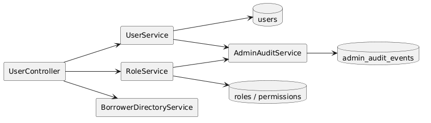
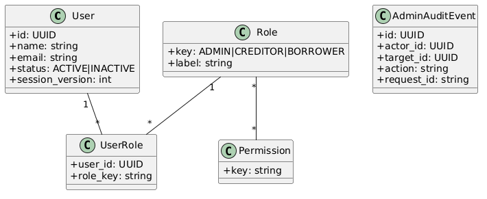

# Module 2: User Management & RBAC

**Requirements**: L1-2, L1-8, L2-2.1, L2-2.2, L2-2.3, L2-2.4, L2-2.5, L2-8.4

## Overview

This module covers administrative user management, controlled RBAC, searchable audit history, and the creditor-safe borrower directory used by loan creation. It replaces the prior free-form permission model and deferred role-enforcement behavior.

## C4 Component Diagram

*Source: [diagrams/plantuml/c4_component_user.puml](diagrams/plantuml/c4_component_user.puml)*

## Class Diagram

*Source: [diagrams/plantuml/class_user_rbac.puml](diagrams/plantuml/class_user_rbac.puml)*

## Public Endpoints

| Method | Path | Description | Auth |
|---|---|---|---|
| `GET` | `/api/v1/users` | List users with search and status filters | Admin |
| `POST` | `/api/v1/users` | Create a user and optional invitation flow | Admin |
| `GET` | `/api/v1/users/{id}` | Get user details | Admin |
| `PATCH` | `/api/v1/users/{id}` | Update name, status, roles, and profile flags | Admin |
| `GET` | `/api/v1/roles` | List canonical roles and permission assignments | Admin |
| `PUT` | `/api/v1/roles/{roleKey}/permissions` | Replace role permissions using the controlled catalog | Admin |
| `GET` | `/api/v1/admin/audit-events` | Search administrative audit events | Admin |
| `GET` | `/api/v1/users/borrowers?search=` | Search verified active borrowers for loan creation | Creditor |

## Permission Catalog

The permission set is fixed in code and data migrations. Roles reference permission keys from this catalog only.

| Permission key | Description |
|---|---|
| `users.read` | View users and account status |
| `users.write` | Create and update users |
| `roles.read` | View roles and permissions |
| `roles.write` | Modify role permission assignments |
| `audit.read` | Search admin audit events |
| `loans.manage_own` | Create and edit creditor-owned loans |
| `loan_change_requests.approve` | Approve or reject borrower change requests |
| `payments.record` | Record payments on participating loans |
| `payments.reverse` | Reverse payment transactions |

## Immediate Revocation Rules

1. Deactivating a user revokes all refresh sessions immediately and increments `session_version`.
2. Removing a privileged role from a user performs the same revocation sequence when the permission set is reduced.
3. Administrative mutations create immutable audit records with actor, target, action, before state, after state, request id, and timestamp.

This behavior resolves the prior "next token refresh" gap.

## Sequence Diagram

*Source: [diagrams/plantuml/seq_user_crud.puml](diagrams/plantuml/seq_user_crud.puml)*

## Data Model

| Entity | Purpose |
|---|---|
| `users` | Account status, verification state, session version, profile fields |
| `roles` | Canonical role definitions (`ADMIN`, `CREDITOR`, `BORROWER`) |
| `permissions` | Controlled permission catalog |
| `role_permissions` | Join table from roles to permission keys |
| `user_roles` | Join table from users to roles |
| `admin_audit_events` | Searchable admin-action history |

## Borrower Directory Rules

- Only active, email-verified borrowers appear in directory results.
- Results are limited to a small projection: id, name, email.
- The endpoint is searchable, paged, and intended for debounced use from the creditor loan form.
- The directory is not a general-purpose user list for non-admin users.
