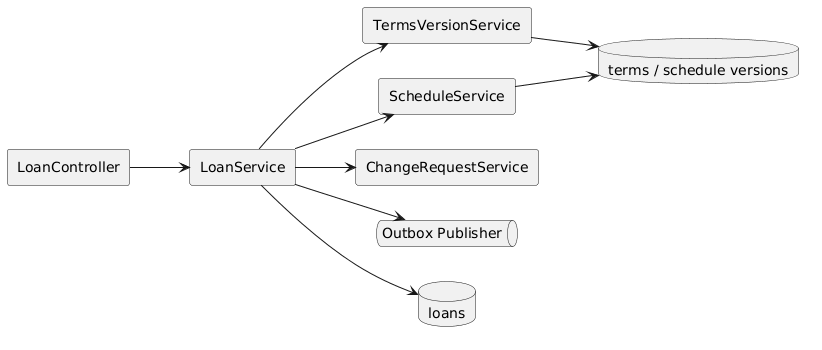
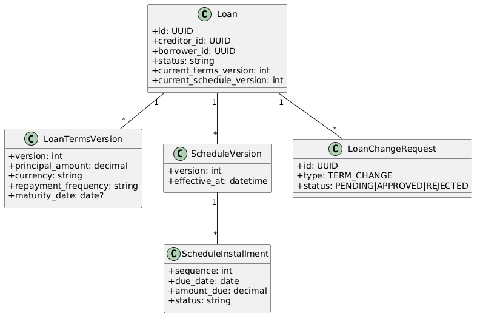

# Module 3: Loan Management & Terms Governance

**Requirements**: L1-3, L1-9, L2-3.1, L2-3.2, L2-3.3, L2-3.4, L2-3.5, L2-9.2, L2-9.3

## Overview

The loan module owns loan creation, creditor-controlled term edits, auditable terms history, and borrower change-request governance. Loan terms and schedules are versioned so the system can reproduce historical balances and notifications against the correct effective contract.

## C4 Component Diagram

*Source: [diagrams/plantuml/c4_component_loan.puml](diagrams/plantuml/c4_component_loan.puml)*

## Class Diagram

*Source: [diagrams/plantuml/class_loan.puml](diagrams/plantuml/class_loan.puml)*

## Public Endpoints

| Method | Path | Description | Auth |
|---|---|---|---|
| `GET` | `/api/v1/loans` | List loans for the current user context | Creditor, Borrower |
| `POST` | `/api/v1/loans` | Create a new loan | Creditor |
| `GET` | `/api/v1/loans/{loanId}` | Get loan detail including current terms and schedule | Creditor, Borrower |
| `PATCH` | `/api/v1/loans/{loanId}` | Update creditor-controlled loan terms | Creditor owner |
| `GET` | `/api/v1/loans/{loanId}/terms-versions` | List historical terms versions | Creditor, Borrower |
| `GET` | `/api/v1/loans/{loanId}/change-requests` | List pending and historical change requests | Creditor, Borrower |
| `POST` | `/api/v1/loans/{loanId}/change-requests` | Submit a borrower change request | Borrower participant |
| `POST` | `/api/v1/loans/{loanId}/change-requests/{requestId}/approve` | Approve a change request and create a new version | Creditor owner |
| `POST` | `/api/v1/loans/{loanId}/change-requests/{requestId}/reject` | Reject a change request | Creditor owner |

## Loan Aggregate

| Entity | Purpose |
|---|---|
| `loans` | Stable loan identity, borrower, creditor, status, current version pointers |
| `loan_terms_versions` | Versioned contractual terms including principal, currency, rate, frequency, and maturity model |
| `schedule_versions` | Versioned payment schedule projections tied to a terms version or schedule adjustment |
| `schedule_installments` | Installment rows for a schedule version |
| `loan_change_requests` | Borrower-submitted requests with reason, proposed changes, approval state, and outcome |

## Terms Rules

Each terms version includes:

- `principal_amount`
- `currency`
- `interest_rate_percent`
- `repayment_frequency` in `WEEKLY`, `BIWEEKLY`, `MONTHLY`, or `CUSTOM`
- either `installment_count`, `maturity_date`, or a `custom_schedule`
- `start_date`
- creditor notes

Creation and edit validation requires that installment strategy be complete and internally consistent. Custom schedules are stored as explicit rows and preserved as authored.

## Governance Rules

1. Borrowers can view all terms but cannot directly edit principal, rate, currency, creditor identity, repayment frequency, or installment structure.
2. Borrowers submit requests with a reason and proposed values through `loan_change_requests`.
3. Creditor approval creates a new `loan_terms_version` and, when necessary, a new `schedule_version`.
4. Rejection keeps the active version unchanged and records the outcome for audit and UI history.

## Sequences

### Create Loan

*Source: [diagrams/plantuml/seq_create_loan.puml](diagrams/plantuml/seq_create_loan.puml)*

### Update Loan Terms

*Source: [diagrams/plantuml/seq_update_loan.puml](diagrams/plantuml/seq_update_loan.puml)*

Both creation and update operations run inside a single database transaction and publish an outbox event only after the new active version pointers are committed.

## Concurrency

- Creditor edits require `expected_terms_version`.
- Stale writes return `409 conflict`.
- Approve and reject actions are idempotent at the request level and reject duplicate terminal transitions.
