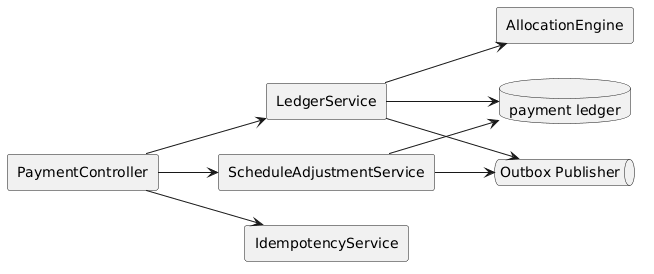
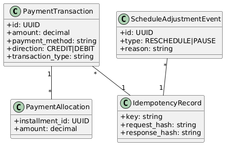
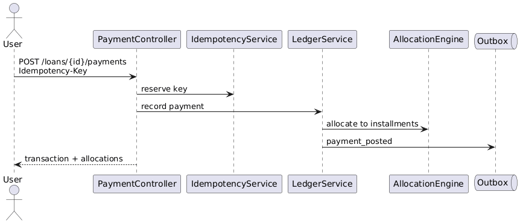
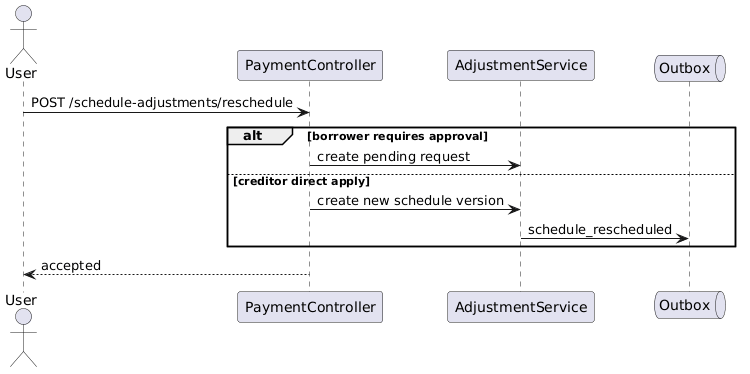
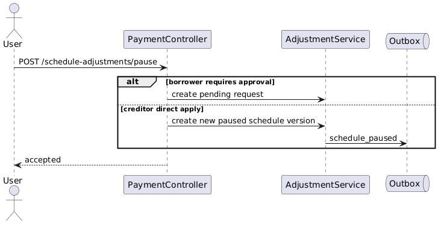

# Module 4: Payment Tracking, Scheduling & Balance Management

**Requirements**: L1-4, L1-8, L1-9, L2-4.1, L2-4.2, L2-4.3, L2-4.4, L2-4.5, L2-4.6, L2-4.7, L2-8.2, L2-9.1, L2-9.3, L2-9.4

## Overview

This module defines the immutable payment ledger, allocation rules, schedule adjustments, reversals, and derived balances. It replaces the previous mutable payment-row model with a financial system of record that is safe for retries, corrections, and audit.

## C4 Component Diagram

*Source: [diagrams/plantuml/c4_component_payment.puml](diagrams/plantuml/c4_component_payment.puml)*

## Class Diagram

*Source: [diagrams/plantuml/class_payment.puml](diagrams/plantuml/class_payment.puml)*

## Public Endpoints

| Method | Path | Description | Auth |
|---|---|---|---|
| `GET` | `/api/v1/loans/{loanId}/schedule` | Return the current schedule version and installment state | Creditor, Borrower |
| `GET` | `/api/v1/loans/{loanId}/payments` | Return immutable payment transactions and allocations | Creditor, Borrower |
| `POST` | `/api/v1/loans/{loanId}/payments` | Record a payment transaction | Creditor, Borrower |
| `POST` | `/api/v1/payments/{paymentId}/reversals` | Reverse a payment with a compensating entry | Creditor, authorized finance ops |
| `POST` | `/api/v1/loans/{loanId}/schedule-adjustments/reschedule` | Reschedule installments or submit a request | Creditor, Borrower |
| `POST` | `/api/v1/loans/{loanId}/schedule-adjustments/pause` | Pause installments or submit a request | Creditor, Borrower |
| `GET` | `/api/v1/loans/{loanId}/history` | Return unified payment and schedule-change history | Creditor, Borrower |

All balance-affecting POST routes require `Idempotency-Key`.

## Ledger Model

| Entity | Purpose |
|---|---|
| `payment_transactions` | Immutable posted payments, reversals, and adjustments |
| `payment_allocations` | Mapping from a transaction to one or more installments |
| `schedule_versions` | Preserved pre- and post-adjustment schedule states |
| `schedule_adjustment_events` | Reschedule and pause events with actor, reason, and effective version |
| `idempotency_records` | Safe-retry registry for monetary writes |

## Posting Rules

1. Payment submission creates one immutable `payment_transaction`.
2. Allocation engine applies funds to installments according to the active allocation policy, typically oldest due first unless a stricter business rule is introduced later.
3. The response returns transaction id, applied allocations, updated balance summary, and any unapplied remainder rules.
4. Duplicate retries with the same idempotency key return the original semantic result and never create another transaction.

## Reversals And Corrections

- Original payment rows are never edited or deleted.
- Reversal creates a compensating `payment_transaction` with direction `DEBIT`.
- The reversal writes inverse allocations against the original installment set.
- Dashboard, loan detail, notification, and history views consume the recalculated balance from ledger-derived projections.

## Schedule Adjustment Rules

- Creditor-submitted reschedules and pauses can apply directly and create a new `schedule_version`.
- Borrower-submitted adjustments create a pending request when policy requires approval.
- Original and updated schedule versions remain queryable for history and audit.
- Adjustment events include actor, reason, request id, and timestamps.

## Sequences

### Record Payment

*Source: [diagrams/plantuml/seq_record_payment.puml](diagrams/plantuml/seq_record_payment.puml)*

### Reschedule Payment

*Source: [diagrams/plantuml/seq_reschedule_payment.puml](diagrams/plantuml/seq_reschedule_payment.puml)*

### Pause Payments

*Source: [diagrams/plantuml/seq_pause_payment.puml](diagrams/plantuml/seq_pause_payment.puml)*

## Balance Source Of Truth

Outstanding balance is derived from the active loan terms version, active schedule version, immutable transactions, and immutable allocations. No screen calculates balance from a mutable schedule row alone.

## Precision Rules

- Currency amounts use fixed-point decimal types.
- Rounding is defined once at the domain layer and reused by projections and APIs.
- Payment history preserves raw posted amount plus displayed formatted amount.
