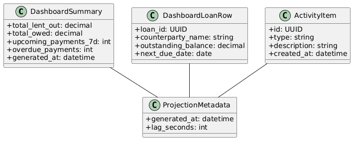
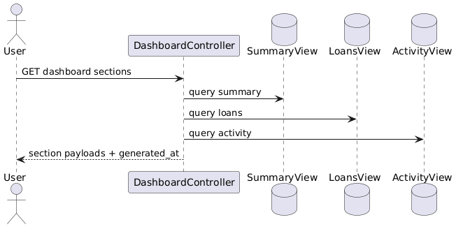

# Module 5: Dashboard

**Requirements**: L1-5, L1-9, L2-5.1, L2-5.2, L2-5.3, L2-5.4, L2-9.1

## Overview

The dashboard serves summary cards, active-loan panels, and recent activity using read models derived from the authoritative loan and payment system of record. It is designed for partial failure tolerance and explicit freshness reporting.

## C4 Component Diagram

*Source: [diagrams/plantuml/c4_component_dashboard.puml](diagrams/plantuml/c4_component_dashboard.puml)*

## Class Diagram

*Source: [diagrams/plantuml/class_dashboard.puml](diagrams/plantuml/class_dashboard.puml)*

## Public Endpoints

| Method | Path | Description | Auth |
|---|---|---|---|
| `GET` | `/api/v1/dashboard/summary` | Summary cards and freshness metadata | Bearer |
| `GET` | `/api/v1/dashboard/loans?view=creditor|borrower` | Active-loan table rows for the selected perspective | Bearer |
| `GET` | `/api/v1/dashboard/activity?limit=` | Recent activity feed | Bearer |

## Read Models

| Projection | Purpose |
|---|---|
| `dashboard_summary_view` | Total lent, total owed, upcoming count, overdue count, projection freshness |
| `dashboard_loans_view` | Lightweight rows for creditor and borrower dashboard tabs |
| `activity_feed_view` | Chronological stream of payment, schedule, loan, and notification-relevant events |

Each projection is updated from outbox-driven workers. The API returns `generated_at` and optional `projection_lag_seconds` so the client can display freshness honestly.

## Sequence Diagram

*Source: [diagrams/plantuml/seq_dashboard.puml](diagrams/plantuml/seq_dashboard.puml)*

## Failure Handling

- Summary, loans, and activity are separate queries so one failing section does not blank the whole page.
- If a projection is stale beyond the agreed threshold, the API still returns the last known good view together with lag metadata.
- Retry is safe because the dashboard API is read-only.

## Balance Consistency

The dashboard never computes balances independently. All money values originate from the same ledger-derived projection pipeline used by loan detail and notifications.
