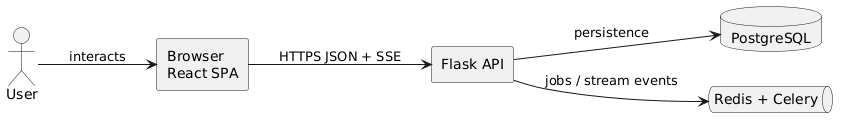
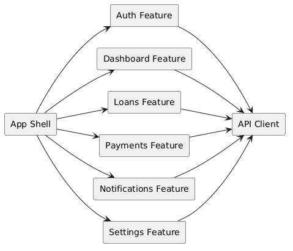
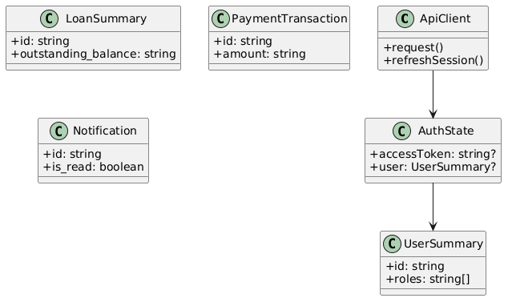
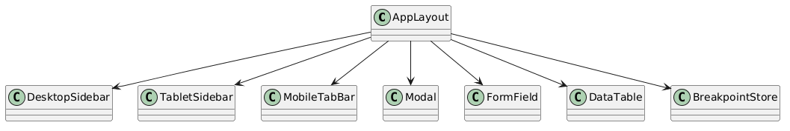
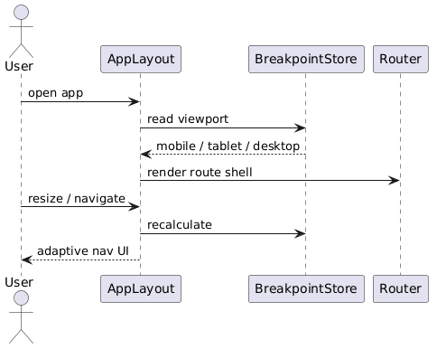
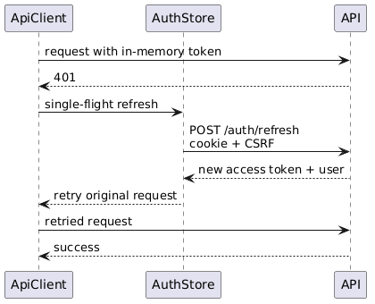

# Module 7: Frontend Architecture

**Requirements**: L1-7, L1-10, L1-12, L2-7.1, L2-7.2, L2-7.3, L2-7.4, L2-7.5, L2-10.1, L2-10.2, L2-10.3, L2-12.1, L2-12.2

## Overview

The LendQ frontend is a React SPA built with TypeScript, Vite, React Router, TanStack Query, and a shared component system derived from `docs/ui-design.pen`. The frontend now aligns with the secure session model, the versioned API contract, and the responsive and accessibility requirements.

## Technology Stack

| Layer | Technology |
|---|---|
| Language | TypeScript 5 |
| UI framework | React 18 |
| Build tool | Vite |
| Routing | React Router 6 |
| Server state | TanStack Query 5 |
| Forms | React Hook Form + Zod |
| Styling | Tailwind CSS 4 + design tokens |
| Tables and lists | Virtualized rows where datasets warrant it |
| Contract types | Generated from [docs/api/openapi.yaml](../api/openapi.yaml) |

## C4 Container Diagram



*Source: [diagrams/plantuml/fe_c4_container.puml](diagrams/plantuml/fe_c4_container.puml)*

## C4 Component Diagram



*Source: [diagrams/plantuml/fe_c4_component_spa.puml](diagrams/plantuml/fe_c4_component_spa.puml)*

## Project Structure

```text
src/
  app/
    router.tsx
    queryClient.ts
    providers/
  api/
    client.ts
    auth.ts
    generated/
  features/
    auth/
    dashboard/
    loans/
    payments/
    notifications/
    settings/
    users/
  shared/
    ui/
    layout/
    accessibility/
    utils/
```

## Route Map

| Path | Page | Auth | Roles |
|---|---|---|---|
| `/login` | `LoginPage` | No | Any |
| `/signup` | `SignUpPage` | No | Any |
| `/verify-email` | `VerifyEmailPage` | No | Any |
| `/forgot-password` | `ForgotPasswordPage` | No | Any |
| `/reset-password/:token` | `ResetPasswordPage` | No | Any |
| `/dashboard` | `DashboardPage` | Yes | Admin, Creditor, Borrower |
| `/loans` | `LoanListPage` | Yes | Creditor, Borrower |
| `/loans/new` | `CreateLoanPage` or modal route | Yes | Creditor |
| `/loans/:id` | `LoanDetailPage` | Yes | Creditor, Borrower |
| `/loans/:id/edit` | `EditLoanPage` or modal route | Yes | Creditor owner |
| `/users` | `UserListPage` | Yes | Admin |
| `/users/roles` | `RoleManagementPage` | Yes | Admin |
| `/notifications` | `NotificationListPage` | Yes | Any authenticated |
| `/settings/preferences` | `PreferencesPage` | Yes | Any authenticated |
| `/settings/security` | `SecurityPage` | Yes | Any authenticated |

Borrowers do not receive a direct loan-edit route. Borrower-initiated term or schedule changes are handled through request flows described in Modules 10 and 11.

## API Client And Session Bootstrap



*Source: [diagrams/plantuml/fe_class_api_types.puml](diagrams/plantuml/fe_class_api_types.puml)*

The API client is generated and wrapped by a thin adapter that adds:

- `Authorization: Bearer <access token>` from in-memory state only
- `X-CSRF-Token` on cookie-authenticated endpoints
- `X-Request-Id` generation and propagation
- single-flight refresh retry for concurrent `401` responses

Protected routes render behind an `AuthBootstrapBoundary`:

1. On first load, the app attempts `POST /api/v1/auth/refresh`.
2. If refresh succeeds, memory state is hydrated and protected routes render.
3. If refresh fails, the router redirects to `/login` without flashing protected content.

## Responsive Shell



*Source: [diagrams/plantuml/fe_class_layout.puml](diagrams/plantuml/fe_class_layout.puml)*

| Breakpoint | Navigation |
|---|---|
| Desktop `>=1280px` | Fixed left sidebar |
| Tablet `768-1279px` | Collapsible sidebar with top header trigger |
| Mobile `<768px` | Top header plus bottom tab bar and overflow sheet |

## Accessibility Baseline

- All dialogs trap focus and restore focus on close.
- Forms associate inline errors to controls via `aria-describedby`.
- Keyboard-visible focus rings are part of the shared design token set.
- Toasts and async status messages use appropriate live-region semantics.
- Table actions remain keyboard reachable on desktop and mobile card variants.

## Performance Baseline

- Login and dashboard are separate code-split entry routes.
- Initial auth route JS budget targets a compact first load; dashboard modules are lazy-loaded after authentication.
- Large user, loan, and notification lists use paging and virtualization where row counts justify it.
- Mutations show pending state immediately and disable duplicate submission.

## Sequences

### Responsive Navigation



*Source: [diagrams/plantuml/fe_seq_responsive_nav.puml](diagrams/plantuml/fe_seq_responsive_nav.puml)*

### Token Refresh



*Source: [diagrams/plantuml/fe_seq_token_refresh.puml](diagrams/plantuml/fe_seq_token_refresh.puml)*
