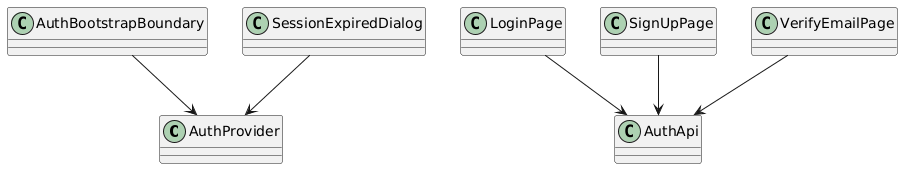

# Module 8: Frontend - Authentication

**Requirements**: L1-1, L1-8, L1-10, L2-1.1, L2-1.2, L2-1.3, L2-1.4, L2-1.5, L2-8.1, L2-10.1, L2-10.3

**Backend API**: [01-authentication.md](01-authentication.md)

## Overview

The frontend authentication feature implements login, sign-up, verify-email, forgot-password, reset-password, session bootstrap, and session-expiry handling. It uses the secure session model defined in Modules 1 and 15.

## Class Diagram

*Source: [diagrams/plantuml/fe_class_auth.puml](diagrams/plantuml/fe_class_auth.puml)*

## Pages

| Page | Purpose |
|---|---|
| `LoginPage` | Collect credentials and show generic auth failures |
| `SignUpPage` | Register account and route to verification-required state |
| `VerifyEmailPage` | Confirm token and offer resend flow |
| `ForgotPasswordPage` | Start reset flow with generic success messaging |
| `ResetPasswordPage` | Complete reset and redirect to login |
| `SessionExpiredDialog` | Interrupt protected flows cleanly when refresh fails or session is revoked |

## API Integration

| Action | Endpoint |
|---|---|
| Sign up | `POST /api/v1/auth/signup` |
| Login | `POST /api/v1/auth/login` |
| Refresh | `POST /api/v1/auth/refresh` |
| Current user | `GET /api/v1/auth/me` |
| Resend verification | `POST /api/v1/auth/email-verification/resend` |
| Confirm verification | `POST /api/v1/auth/email-verification/confirm` |
| Forgot password | `POST /api/v1/auth/forgot-password` |
| Reset password | `POST /api/v1/auth/reset-password` |
| Logout | `POST /api/v1/auth/logout` |

## Token Storage

| Item | Storage |
|---|---|
| Access token | Memory only inside auth state |
| Refresh session | `Secure`, `HttpOnly`, `SameSite=Strict` cookie |
| CSRF token | Non-sensitive cookie or bootstrapped value read by the client and echoed in `X-CSRF-Token` |

No auth token is stored in `localStorage` or `sessionStorage`.

## Sequence Diagram

*Source: [diagrams/plantuml/fe_seq_login.puml](diagrams/plantuml/fe_seq_login.puml)*

## UX Rules

- Sign-up success clearly communicates that email verification is required before normal use.
- Session bootstrap blocks protected routes until refresh either succeeds or fails.
- Session-expired responses preserve safe unsaved form state where possible, then route the user to re-authenticate.
- Auth screens reuse the shared auth shell and support mobile, tablet, and desktop layouts.

## Error Handling

- Login, sign-up, and forgot-password flows use generic user-facing auth failures where enumeration is a risk.
- Field-level validation is mapped from API `details`.
- Duplicate submit is prevented while a mutation is in flight.
