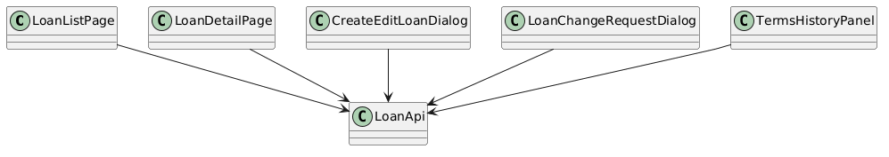
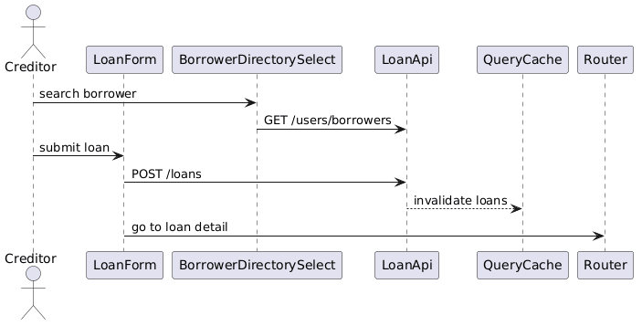

# Module 10: Frontend - Loan Management

**Requirements**: L1-3, L1-10, L2-3.1, L2-3.2, L2-3.3, L2-3.4, L2-3.5, L2-7.5, L2-10.3

**Backend API**: [03-loan-management.md](03-loan-management.md)

## Overview

The loan feature covers loan list views, loan detail, creditor create and edit flows, terms history, and borrower change-request flows. It removes the prior borrower direct-edit path and aligns all creation and edit behavior to the new contract.

## Class Diagram

*Source: [diagrams/plantuml/fe_class_loan.puml](diagrams/plantuml/fe_class_loan.puml)*

## Primary Screens

| Screen | Purpose |
|---|---|
| `LoanListPage` | Creditor and borrower tabs with search and status filters |
| `LoanDetailPage` | Summary, terms, schedule, history, and contextual actions |
| `CreateEditLoanDialog` | Creditor-only create/edit form with schedule builder and preview |
| `LoanChangeRequestDialog` | Borrower request flow for creditor-controlled term changes |
| `TermsHistoryPanel` | Side-by-side view of previous and current terms versions |

## Create/Edit Form

Required fields now include:

- borrower
- description
- principal amount
- currency
- interest rate
- repayment frequency
- installment count or maturity date
- start date
- optional custom schedule rows
- notes

The form renders a generated schedule preview and summary before submission.

## API Integration

| Action | Endpoint |
|---|---|
| List loans | `GET /api/v1/loans` |
| Loan detail | `GET /api/v1/loans/{id}` |
| Borrower directory search | `GET /api/v1/users/borrowers?search=` |
| Create loan | `POST /api/v1/loans` |
| Update loan | `PATCH /api/v1/loans/{id}` |
| Terms history | `GET /api/v1/loans/{id}/terms-versions` |
| Change requests | `GET /api/v1/loans/{id}/change-requests` |
| Submit change request | `POST /api/v1/loans/{id}/change-requests` |
| Approve or reject request | `POST /api/v1/loans/{id}/change-requests/{requestId}/approve|reject` |

## Sequence Diagram

*Source: [diagrams/plantuml/fe_seq_create_loan.puml](diagrams/plantuml/fe_seq_create_loan.puml)*

## Governance Rules In The UI

- Borrowers can view full loan details but do not see the general edit route or edit button.
- Borrowers get `Request change` actions that open `LoanChangeRequestDialog`.
- Creditor edits include `expected_terms_version` in the payload and show a conflict dialog if the server returns `409`.
- Approved requests update the terms history panel and trigger query invalidation for loan detail, schedule, dashboard, and notifications.

## Validation

The loan schema validates:

- currency as ISO 4217
- supported repayment frequency
- exactly one of installment count, maturity date, or custom schedule strategy
- positive currency-formatted principal
- consistent custom schedule totals and dates
