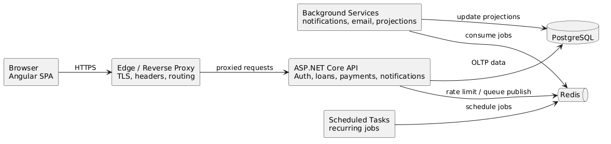

# LendQ

LendQ is a lending management platform for tracking private, family, and small-circle loans with structured workflows for authentication, role-based access control, loan governance, payment tracking, dashboards, notifications, and auditability.

This repository contains the application stack plus supporting project assets:

- a Flask backend API in [`backend/`](./backend)
- a React + TypeScript frontend SPA in [`frontend/`](./frontend)
- a Playwright end-to-end suite in [`e2e/`](./e2e)
- supporting requirements, architecture docs, UI assets, and the OpenAPI contract in [`docs/`](./docs)
- local development infrastructure in [`ops/`](./ops)



## Contents

- [Project Status](#project-status)
- [Feature Coverage](#feature-coverage)
- [Technology Stack](#technology-stack)
- [Repository Layout](#repository-layout)
- [Quick Start](#quick-start)
- [Testing](#testing)
- [Current Integration Notes](#current-integration-notes)
- [Documentation Map](#documentation-map)
- [Contributing](#contributing)
- [License](#license)

## Project Status

LendQ is now a full-stack repository with implemented backend and frontend foundations, but it is still an actively aligning codebase rather than a fully polished production release.

### What exists today

| Area | Status | Notes |
| --- | --- | --- |
| Backend API | Implemented | Flask app factory, controllers, services, repositories, models, migrations, seeding, health checks, and Celery wiring |
| Frontend SPA | Implemented | Vite + React app covering authentication, dashboard, loans, payments, users, notifications, and settings |
| Local dev infrastructure | Implemented | Docker Compose file for PostgreSQL, Redis, and Mailpit |
| API contract | Implemented | OpenAPI source of truth lives in [`docs/api/openapi.yaml`](./docs/api/openapi.yaml) |
| Requirements and architecture docs | Implemented | L1/L2 specs and detailed design modules live in [`docs/`](./docs) |
| Backend tests | Implemented | Unit, integration, and security coverage under [`backend/tests/`](./backend/tests) |
| End-to-end tests | Implemented | Playwright coverage for auth, dashboard, loans, payments, notifications, responsive states, accessibility, and security |
| Full frontend/backend contract alignment | In progress | Some frontend and E2E assumptions still target older auth and seed-data conventions |

## Feature Coverage

The codebase currently includes implementation across the main product domains:

- Authentication and sessions: login, signup, forgot/reset password, email verification, session listing, logout, logout-all, and session revocation
- User management and RBAC: user CRUD, role management, access control, and admin-facing flows
- Loan management: list, detail, create, update, terms versions, and borrower change-request workflows
- Payment tracking: schedule view, history, record payment, reschedule, and pause flows
- Dashboard: summary metrics, active loans, and activity feed
- Notifications: list, unread count, mark read, mark all read, notification preferences, and SSE stream endpoint
- Operations: migrations, seed data, health endpoints, request IDs, security headers, rate limiting, Redis/Celery dependencies, and observability scaffolding

The requirements and design baseline for these areas live in:

- [`docs/specs/L1.md`](./docs/specs/L1.md)
- [`docs/specs/L2.md`](./docs/specs/L2.md)
- [`docs/detailed-designs/00-index.md`](./docs/detailed-designs/00-index.md)

## Technology Stack

### Application stack

| Layer | Technology |
| --- | --- |
| Backend API | Flask 3 |
| ORM and migrations | SQLAlchemy, Flask-SQLAlchemy, Flask-Migrate |
| Validation and serialization | Marshmallow, Flask-Marshmallow |
| Database | PostgreSQL |
| Background jobs | Redis, Celery |
| Frontend | React 19, TypeScript, Vite 8 |
| Styling | Tailwind CSS |
| Client state and forms | TanStack Query, React Hook Form, Zod |
| HTTP client | Axios |
| E2E testing | Playwright |
| Contract governance | OpenAPI 3.1 |
| Design assets | Pencil `.pen`, PlantUML, draw.io |

### Local infrastructure

| Service | Port | Purpose |
| --- | --- | --- |
| Frontend | `5173` | Vite dev server |
| Backend API | `5000` | Flask API |
| PostgreSQL | `5432` | Primary database |
| Redis | `6379` | Rate limiting, broker/backend infrastructure |
| Mailpit SMTP | `1025` | Local mail capture SMTP |
| Mailpit UI | `8025` | Browser mail inbox |

## Repository Layout

```text
LendQ/
|-- backend/
|   |-- app/
|   |-- migrations/
|   |-- tests/
|   |-- pyproject.toml
|   `-- requirements-dev.txt
|-- frontend/
|   |-- src/
|   |-- package.json
|   `-- vite.config.ts
|-- e2e/
|   |-- tests/
|   |-- fixtures/
|   |-- pages/
|   `-- playwright.config.ts
|-- docs/
|   |-- api/openapi.yaml
|   |-- specs/
|   |-- detailed-designs/
|   `-- ui-design.pen
|-- ops/
|   `-- docker-compose.dev.yml
|-- CONTRIBUTING.md
|-- LICENSE
`-- README.md
```

## Quick Start

### Prerequisites

- Python 3.11+
- Node.js 20+
- npm
- Docker Desktop

### 1. Start local infrastructure

```bash
docker compose -f ops/docker-compose.dev.yml up -d
```

This starts PostgreSQL, Redis, and Mailpit.

### 2. Create a Python virtual environment and install backend dependencies

```bash
python -m venv .venv
```

Windows PowerShell:

```powershell
.venv\Scripts\Activate.ps1
```

macOS/Linux:

```bash
source .venv/bin/activate
```

Install backend dependencies:

```bash
pip install -r backend/requirements-dev.txt
```

### 3. Run database migrations

```bash
cd backend
python -m flask --app app:create_app db upgrade
```

### 4. Seed demo data

```bash
python -m app.seed --profile demo
```

Demo accounts created by the seed script:

| Role | Email | Password |
| --- | --- | --- |
| Admin | `admin@lendq.local` | `admin123` |
| Creditor | `creditor@lendq.local` | `password123` |
| Borrower | `borrower1@lendq.local` | `password123` |
| Borrower | `borrower2@lendq.local` | `password123` |

### 5. Start the backend API

From the `backend/` directory:

```bash
python -m flask --app app:create_app --debug run --host 0.0.0.0 --port 5000
```

Useful endpoints:

- API base: `http://localhost:5000/api/v1`
- Liveness: `http://localhost:5000/health/live`
- Readiness: `http://localhost:5000/health/ready`

### 6. Start the frontend

From the repository root in a new terminal:

```bash
npm --prefix frontend install
npm --prefix frontend run dev
```

The frontend runs at `http://localhost:5173`.

### 7. Inspect email traffic

Mailpit UI is available at `http://localhost:8025`.

It captures verification and password-reset emails sent by the backend.

## Testing

### Backend tests

From the `backend/` directory with the virtual environment active:

```bash
pytest
```

The backend test suite includes:

- unit tests under [`backend/tests/unit/`](./backend/tests/unit)
- integration tests under [`backend/tests/integration/`](./backend/tests/integration)
- security-focused tests under [`backend/tests/security/`](./backend/tests/security)

### Frontend checks

```bash
npm --prefix frontend run lint
npm --prefix frontend run build
```

### Playwright end-to-end tests

```bash
npm --prefix e2e install
npm --prefix e2e exec playwright install
npm --prefix e2e run test
```

Useful variants:

```bash
npm --prefix e2e run test:headed
npm --prefix e2e run test:ui
npm --prefix e2e run test:chromium
npm --prefix e2e run test:tablet
npm --prefix e2e run test:mobile
```

## Current Integration Notes

The backend is implemented, but there are still a few practical alignment issues worth knowing before you expect turnkey full-stack behavior:

- The frontend API client uses a same-origin base path of `/api/v1`, while the backend dev server runs on `http://localhost:5000`.
- The current Vite config does not proxy `/api` to the backend.
- The backend auth flow now uses an `HttpOnly` session cookie plus an access token response, while the current frontend client still stores refresh-token state in `localStorage`.
- The backend demo seed creates `@lendq.local` accounts, while the current Playwright fixtures still reference `@family.com` users.

For local browser development, you will likely want to proxy API traffic from Vite to Flask. A minimal example in [`frontend/vite.config.ts`](./frontend/vite.config.ts) would look like:

```ts
server: {
  port: 5173,
  proxy: {
    "/api": "http://localhost:5000",
  },
}
```

Treat the repository as having implemented backend and frontend foundations, with some integration cleanup still needed between the live frontend, seeded backend data, and E2E fixtures.

## Documentation Map

Start here for the full system picture:

- [`docs/specs/L1.md`](./docs/specs/L1.md): high-level product and platform requirements
- [`docs/specs/L2.md`](./docs/specs/L2.md): detailed acceptance criteria
- [`docs/detailed-designs/00-index.md`](./docs/detailed-designs/00-index.md): architecture index and module map
- [`docs/api/openapi.yaml`](./docs/api/openapi.yaml): machine-readable API contract
- [`docs/local-development-workflow.md`](./docs/local-development-workflow.md): recommended local development conventions
- [`docs/repository-structure.md`](./docs/repository-structure.md): repository structure and traceability notes

Detailed design modules:

- [`docs/detailed-designs/01-authentication.md`](./docs/detailed-designs/01-authentication.md)
- [`docs/detailed-designs/02-user-management.md`](./docs/detailed-designs/02-user-management.md)
- [`docs/detailed-designs/03-loan-management.md`](./docs/detailed-designs/03-loan-management.md)
- [`docs/detailed-designs/04-payment-tracking.md`](./docs/detailed-designs/04-payment-tracking.md)
- [`docs/detailed-designs/05-dashboard.md`](./docs/detailed-designs/05-dashboard.md)
- [`docs/detailed-designs/06-notifications.md`](./docs/detailed-designs/06-notifications.md)
- [`docs/detailed-designs/07-fe-architecture.md`](./docs/detailed-designs/07-fe-architecture.md)
- [`docs/detailed-designs/08-fe-authentication.md`](./docs/detailed-designs/08-fe-authentication.md)
- [`docs/detailed-designs/09-fe-user-management.md`](./docs/detailed-designs/09-fe-user-management.md)
- [`docs/detailed-designs/10-fe-loan-management.md`](./docs/detailed-designs/10-fe-loan-management.md)
- [`docs/detailed-designs/11-fe-payment-tracking.md`](./docs/detailed-designs/11-fe-payment-tracking.md)
- [`docs/detailed-designs/12-fe-dashboard.md`](./docs/detailed-designs/12-fe-dashboard.md)
- [`docs/detailed-designs/13-fe-notifications.md`](./docs/detailed-designs/13-fe-notifications.md)
- [`docs/detailed-designs/14-fe-settings-preferences.md`](./docs/detailed-designs/14-fe-settings-preferences.md)
- [`docs/detailed-designs/15-security-session-architecture.md`](./docs/detailed-designs/15-security-session-architecture.md)
- [`docs/detailed-designs/16-operational-readiness-and-api-governance.md`](./docs/detailed-designs/16-operational-readiness-and-api-governance.md)

## Contributing

Contributions are welcome! Please see [CONTRIBUTING.md](CONTRIBUTING.md) for guidelines on how to get started, submit pull requests, and report issues.

## License

This project is licensed under the MIT License. See the [LICENSE](LICENSE) file for details.
