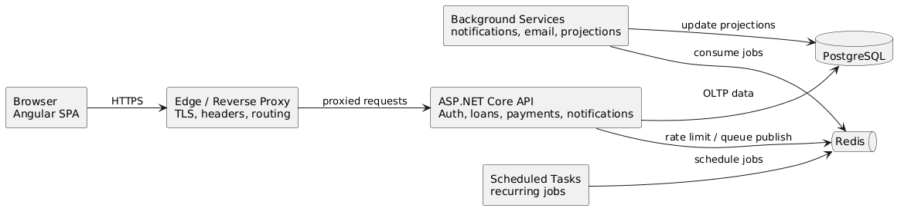
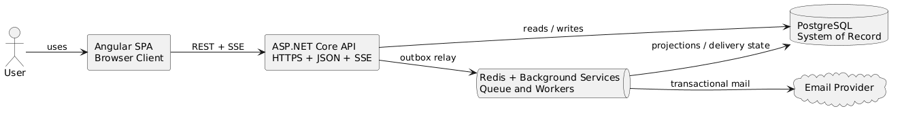

<p align="center">
  
</p>

<h1 align="center">LendQ</h1>

<p align="center">
  <strong>Private Lending Management Platform</strong> — Track family, friend, and small-circle loans
</p>

<p align="center">
  <a href="#features">Features</a> · <a href="#tech-stack">Tech Stack</a> · <a href="#getting-started">Getting Started</a> · <a href="#architecture">Architecture</a> · <a href="#contributing">Contributing</a> · <a href="#license">License</a>
</p>

<p align="center">
  <a href="https://github.com/QuinntyneBrown/LendQ/actions/workflows/deploy-staging.yml"></a>
  
  
  
  
  
</p>

---

LendQ is a lending management platform for tracking private, family, and small-circle loans with structured workflows for authentication, role-based access control, loan governance, payment tracking, dashboards, notifications, and auditability. The platform is deployed to Azure with automated CI/CD — pushes to `main` auto-deploy to the staging environment.

## Features

### For Creditors & Borrowers

- **Loan Management** — Create, update, and track loans with terms versioning and borrower change-request workflows
- **Payment Tracking** — Schedule view, history, record payments, reschedule, and pause flows
- **Dashboard** — Summary metrics, active loans, and activity feed at a glance
- **Notifications** — Real-time SSE stream, unread counts, mark read, and notification preferences
- **Authentication** — Login, signup, forgot/reset password, email verification, session management, and logout-all

### For Admins

- **User Management & RBAC** — User CRUD, role management, and access control
- **Audit Trails** — Request IDs, security headers, and comprehensive logging
- **Operational Readiness** — Health endpoints, rate limiting, Redis/Celery infrastructure, and observability scaffolding

## Architecture

<p align="center">
  
</p>
<p align="center"><em>System context — LendQ and its external integrations</em></p>

<p align="center">
  
</p>
<p align="center"><em>Container diagram — backend, frontend, database, and supporting services</em></p>

## Tech Stack

| Layer | Technology |
|-------|------------|
| **Backend API** | Flask 3 (Python), SQLAlchemy, Flask-Migrate, Marshmallow, FluentValidation |
| **Database** | PostgreSQL 16 |
| **Background Jobs** | Redis, Celery |
| **Frontend** | React 19, TypeScript, Vite 8, Tailwind CSS, TanStack Query, React Hook Form, Zod |
| **E2E Testing** | Playwright |
| **CI/CD** | GitHub Actions |
| **Cloud Hosting** | Azure (Container Apps, Static Web Apps, PostgreSQL Flexible Server, Redis, Key Vault, Application Insights) |
| **Infrastructure as Code** | Bicep |
| **Contract Governance** | OpenAPI 3.1 |
| **Design Assets** | Pencil `.pen`, PlantUML, draw.io |

## Project Structure

```text
LendQ/
├── backend/
│   ├── app/
│   ├── migrations/
│   ├── tests/
│   ├── pyproject.toml
│   └── requirements-dev.txt
├── frontend/
│   ├── src/
│   ├── package.json
│   └── vite.config.ts
├── e2e/
│   ├── tests/
│   ├── fixtures/
│   ├── pages/
│   └── playwright.config.ts
├── docs/
│   ├── api/openapi.yaml
│   ├── specs/
│   ├── detailed-designs/
│   └── ui-design.pen
├── ops/
│   ├── azure/
│   │   ├── modules/
│   │   ├── main.bicep
│   │   ├── main.staging.bicepparam
│   │   ├── main.production.bicepparam
│   │   └── github-secrets-setup.txt
│   └── docker-compose.dev.yml
├── CONTRIBUTING.md
├── LICENSE
└── README.md
```

## Getting Started

### Prerequisites

- [Python 3.11+](https://www.python.org/)
- [Node.js 20+](https://nodejs.org/)
- [Docker & Docker Compose](https://docs.docker.com/get-docker/)

### Quick Start

```bash
# 1. Clone the repository
git clone https://github.com/QuinntyneBrown/LendQ.git
cd LendQ

# 2. Start local infrastructure (PostgreSQL, Redis, Mailpit)
docker compose -f ops/docker-compose.dev.yml up -d

# 3. Configure and install backend
cp backend/.env.example backend/.env
python -m venv .venv
source .venv/bin/activate        # Windows: .venv\Scripts\Activate.ps1
pip install -r backend/requirements-dev.txt

# 4. Run database migrations and seed demo data
cd backend
python -m flask --app app:create_app db upgrade
python -m app.seed --profile demo
cd ..

# 5. Start the backend API (http://localhost:5000)
cd backend
python -m flask --app app:create_app --debug run --host 0.0.0.0 --port 5000

# 6. Start the frontend (http://localhost:5173) — in a new terminal
npm --prefix frontend install
npm --prefix frontend run dev
```

### Demo Accounts

| Role | Email | Password |
|------|-------|----------|
| Admin | `admin@lendq.local` | `admin123` |
| Creditor | `creditor@lendq.local` | `password123` |
| Borrower | `borrower1@lendq.local` | `password123` |
| Borrower | `borrower2@lendq.local` | `password123` |

### Running Tests

```bash
# Backend quality checks
cd backend
ruff check . && ruff format --check . && pytest

# Frontend checks
npm --prefix frontend run lint
npm --prefix frontend run test
npm --prefix frontend run build

# Playwright end-to-end tests
npm --prefix e2e install
npm --prefix e2e exec playwright install
npm --prefix e2e run test
```

## CI/CD and Deployment

| Workflow | Trigger | Purpose |
|----------|---------|---------|
| **Deploy to Staging** | Push to `main`, manual dispatch | Builds and deploys backend + frontend to Azure staging |
| **E2E PR Fast Path** | Pull request | Runs smoke + responsive E2E tests |
| **E2E Full Regression** | Daily at 06:00 UTC, manual dispatch | Full cross-browser E2E regression |

### Azure Staging Environment

| Resource | Service | Name |
|----------|---------|------|
| Frontend | Azure Static Web Apps | `swa-lendq-staging` |
| API | Azure Container Apps | `lendq-api-staging` |
| Worker | Azure Container Apps | `lendq-worker-staging` |
| Beat | Azure Container Apps | `lendq-beat-staging` |
| Database | PostgreSQL Flexible Server | `psql-lendq-staging` |
| Cache/Broker | Azure Cache for Redis | `redis-lendq-staging` |
| Secrets | Azure Key Vault | `kv-lendq-staging` |
| Monitoring | Application Insights | `ai-lendq-staging` |

Infrastructure is defined in Bicep under [`ops/azure/`](./ops/azure).

## Documentation Map

- [`docs/specs/L1.md`](./docs/specs/L1.md) — High-level product and platform requirements
- [`docs/specs/L2.md`](./docs/specs/L2.md) — Detailed acceptance criteria
- [`docs/detailed-designs/00-index.md`](./docs/detailed-designs/00-index.md) — Architecture index and module map
- [`docs/api/openapi.yaml`](./docs/api/openapi.yaml) — Machine-readable API contract

## Contributing

Contributions are welcome! Please see [CONTRIBUTING.md](CONTRIBUTING.md) for guidelines on how to get started.

## License

This project is licensed under the [MIT License](LICENSE).
