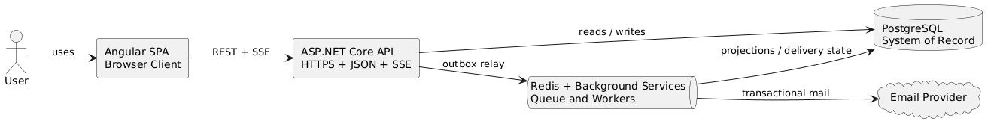

# LendQ — Detailed Design Documentation

## Backend Technology Stack

| Layer | Technology |
|-------|-----------|
| Language | Python 3.11+ |
| Web Framework | Flask 3.x |
| ORM | SQLAlchemy 2.x |
| Database | PostgreSQL 15+ |
| Authentication | JWT (PyJWT) |
| Password Hashing | bcrypt |
| API Serialization | Marshmallow |
| Migration | Alembic |
| Testing | pytest |

## Frontend Technology Stack

| Layer | Technology |
|-------|-----------|
| Language | TypeScript 5.x |
| UI Framework | React 18 |
| Build Tool | Vite |
| Routing | React Router 6 |
| Server State | TanStack Query (React Query) 5 |
| HTTP Client | Axios |
| Styling | Tailwind CSS 3 |
| Icons | Lucide React |
| Forms | React Hook Form + Zod |
| Date Handling | date-fns |
| Testing | Vitest + React Testing Library |

## Architecture Overview

LendQ is a full-stack application with a React SPA frontend communicating with a Flask REST API backend over HTTPS using JWT bearer tokens.

### Backend Architecture

The backend follows a layered architecture pattern:

- **Controller Layer** — Flask Blueprints exposing REST endpoints
- **Service Layer** — Business logic orchestration
- **Repository Layer** — Data access abstraction over SQLAlchemy
- **Entity/Model Layer** — SQLAlchemy ORM models

### Frontend Architecture

The frontend is organized into feature modules within a single-page application:

- **App Shell** — Root layout, responsive navigation (sidebar / bottom nav), routing
- **Feature Modules** — Auth, Dashboard, Loans, Payments, Users, Notifications
- **Shared UI** — Reusable components (Button, Input, Modal, DataTable, Badge, etc.)
- **API Client** — Axios instance with auth interceptors and automatic token refresh
- **Auth Context** — React context providing user state, roles, and route guards
- **TanStack Query** — Server state caching, mutations, and cache invalidation

### C4 Context Diagram



### C4 Container Diagram (Backend)


### C4 Container Diagram (Full-Stack)


### C4 Component Diagram (React SPA)


## Backend Module Design Documents

| # | Module | Document |
|---|--------|----------|
| 1 | [Authentication](01-authentication.md) | Login, signup, password reset, JWT tokens |
| 2 | [User Management & RBAC](02-user-management.md) | User CRUD, roles, permissions |
| 3 | [Loan Management](03-loan-management.md) | Loan CRUD, creditor/borrower views |
| 4 | [Payment Tracking & Scheduling](04-payment-tracking.md) | Payments, rescheduling, pausing, history |
| 5 | [Dashboard](05-dashboard.md) | Summary metrics, active loans, activity feed |
| 6 | [Notifications](06-notifications.md) | In-app notifications, email alerts |

## Frontend Module Design Documents

| # | Module | Document |
|---|--------|----------|
| 7 | [Frontend Architecture](07-fe-architecture.md) | Tech stack, SPA structure, design system, responsive strategy, shared UI |
| 8 | [Frontend — Authentication](08-fe-authentication.md) | Login, signup, forgot password screens, AuthContext, token management |
| 9 | [Frontend — User Management](09-fe-user-management.md) | User list, add/edit/delete dialogs, role management |
| 10 | [Frontend — Loan Management](10-fe-loan-management.md) | Loan list (creditor/borrower), loan detail, create/edit modal |
| 11 | [Frontend — Payment Tracking](11-fe-payment-tracking.md) | Payment schedule, record/reschedule/pause dialogs, history |
| 12 | [Frontend — Dashboard](12-fe-dashboard.md) | Summary cards, active loans panel, activity feed, responsive layouts |
| 13 | [Frontend — Notifications](13-fe-notifications.md) | Bell dropdown, toast system, full notifications page |

## UI Design Source

The frontend screens, components, and design system are defined in [`ui-design.pen`](../ui-design.pen). This file contains:

- **Design System**: Buttons (Primary, Secondary, Destructive, Ghost), Inputs, Selects, Textareas, Badges (Active, Overdue, Paused, PaidOff), Navigation items, Cards, Modals, Toasts, MetricCards
- **Auth Screens**: Login, Sign Up, Forgot Password (desktop two-panel layout)
- **App Screens**: Dashboard, User Management, Loan Detail (desktop with sidebar)
- **Modals**: Add/Edit User, Delete User, Create/Edit Loan, Record Payment, Reschedule Payment, Pause Payment
- **Notification Components**: Bell dropdown, toast notification stack
- **Responsive Layouts**: Dashboard at mobile (375px) and tablet (768px) breakpoints

## Cross-Cutting Concerns

### API Conventions

All endpoints follow these conventions:

- Base URL: `/api/v1`
- Authentication: Bearer JWT in `Authorization` header
- Request/Response: `application/json`
- Pagination: `?page=1&per_page=20` returning `{items, total, page, per_page, pages}`
- Errors: `{error: string, code: string, details?: object}`
- HTTP Status Codes: 200 (OK), 201 (Created), 204 (No Content), 400 (Bad Request), 401 (Unauthorized), 403 (Forbidden), 404 (Not Found), 409 (Conflict), 422 (Validation Error), 500 (Internal Server Error)

### Database Schema Conventions

- Primary keys: UUID v4 (`id` column)
- Timestamps: `created_at`, `updated_at` (UTC, auto-managed)
- Soft deletes: `is_active` boolean flag (no hard deletes on users)
- Foreign keys: `<entity>_id` naming convention
- Indexes: on all foreign keys and commonly filtered columns

### Error Handling

A global error handler catches exceptions and returns structured JSON:

```python
@app.errorhandler(Exception)
def handle_error(error):
    response = {"error": str(error), "code": error.__class__.__name__}
    return jsonify(response), getattr(error, 'status_code', 500)
```

Custom exception classes: `AuthenticationError(401)`, `AuthorizationError(403)`, `NotFoundError(404)`, `ConflictError(409)`, `ValidationError(422)`.

### Frontend Error Handling

- **API errors**: Caught by Axios interceptors. 401s trigger automatic token refresh. Other errors are surfaced via toast notifications.
- **Form validation errors**: Zod schemas validate client-side before submission. Backend 422 responses map `details` to inline field errors.
- **Network errors**: Toast notification with retry suggestion.

### Frontend State Management

- **Server state**: Managed entirely by TanStack Query. No local duplication of API data.
- **Auth state**: React context (`AuthContext`) — user profile, roles, tokens.
- **UI state**: Local component state (React `useState`) — modal open/close, form values, search queries.
- **Cache invalidation**: Mutations invalidate related query keys to trigger automatic refetches.

## Diagram Sources

- **PlantUML sources**: [`diagrams/plantuml/`](diagrams/plantuml/) — includes both backend (`c4_*`, `class_*`, `seq_*`) and frontend (`fe_*`) diagrams
- **Draw.io sources**: [`diagrams/drawio/`](diagrams/drawio/) — open in [draw.io](https://app.diagrams.net) for editing
- **Rendered PNGs**: [`diagrams/rendered/`](diagrams/rendered/)
- **Render scripts**: [`diagrams/render_plantuml.py`](diagrams/render_plantuml.py)
