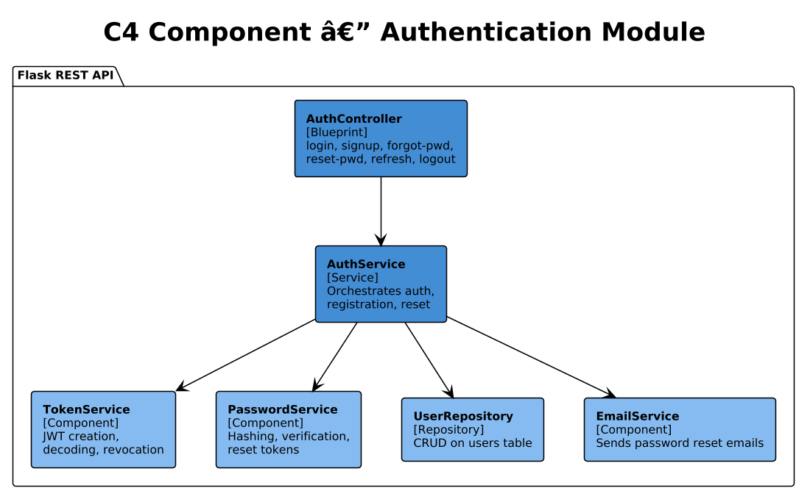
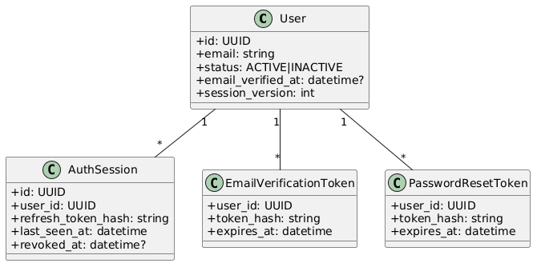
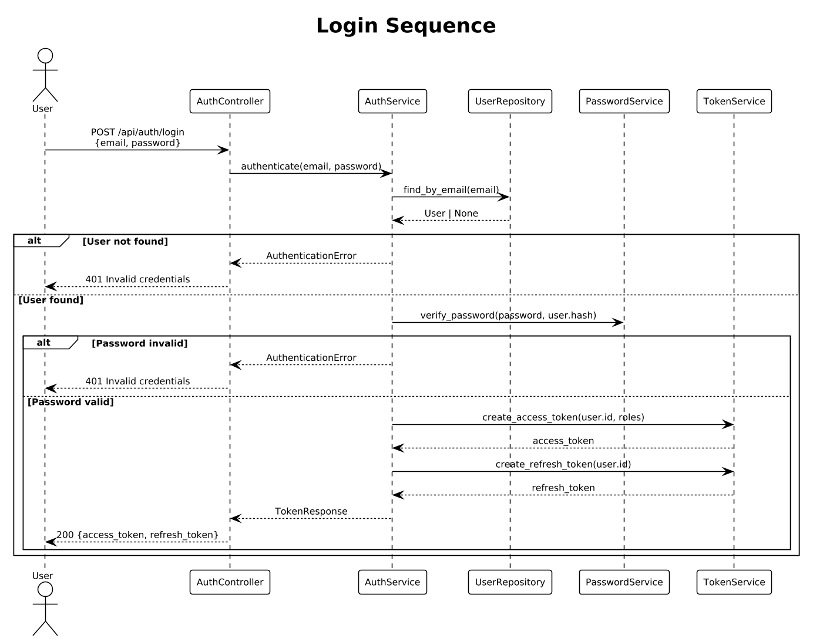
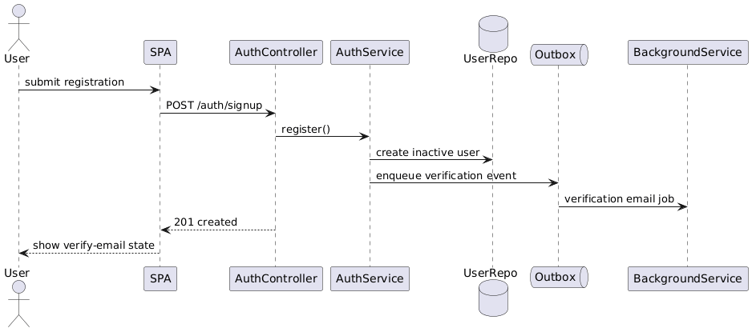
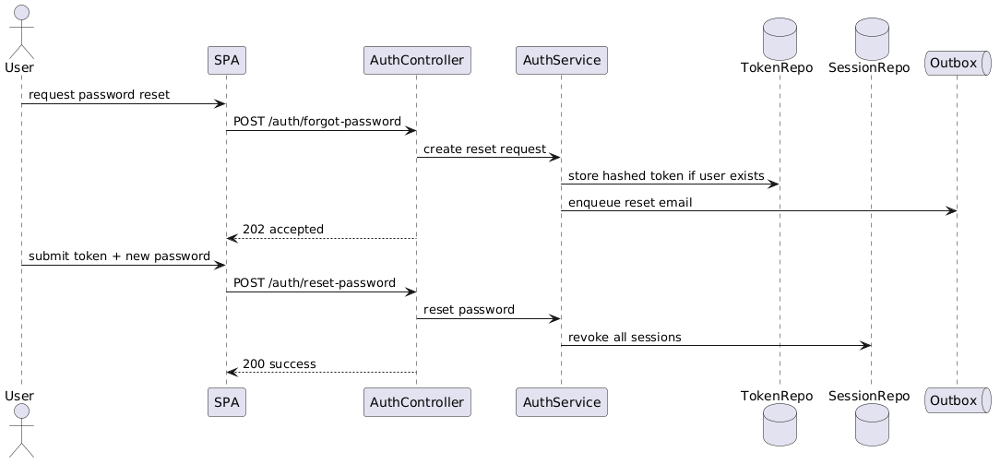

# Module 1: Authentication

**Requirements**: L1-1, L2-1.1, L2-1.2, L2-1.3

## Overview

The Authentication module handles user login, registration, password reset, JWT token management, and session lifecycle. It is the gateway for all authenticated access to the LendQ API.

## C4 Component Diagram



*Source: [diagrams/drawio/c4_component_auth.drawio](diagrams/drawio/c4_component_auth.drawio)*

## Class Diagram



*Source: [diagrams/rendered/class_auth.png](diagrams/rendered/class_auth.png)*

## REST API Endpoints

| Method | Path | Description | Auth |
|--------|------|-------------|------|
| POST | `/api/v1/auth/login` | Authenticate user, return tokens | No |
| POST | `/api/v1/auth/signup` | Register new user | No |
| POST | `/api/v1/auth/forgot-password` | Initiate password reset | No |
| POST | `/api/v1/auth/reset-password` | Complete password reset | No |
| POST | `/api/v1/auth/refresh` | Refresh access token | Refresh Token |
| POST | `/api/v1/auth/logout` | Revoke current token | Bearer |

## Sequence Diagrams

### Login Flow



*Source: [diagrams/rendered/seq_login.png](diagrams/rendered/seq_login.png)*

**Behavior**:
1. User submits email and password.
2. `AuthService` looks up the user by email via `UserRepository`.
3. `PasswordService` verifies the password against the stored bcrypt hash.
4. On success, `TokenService` generates a JWT access token (15 min TTL) and a refresh token (7 day TTL).
5. Both tokens are returned in the response. The refresh token is also stored hashed in the database for revocation support.
6. On failure at any step, a generic 401 "Invalid credentials" is returned (no user enumeration).

### Sign-Up Flow



*Source: [diagrams/rendered/seq_signup.png](diagrams/rendered/seq_signup.png)*

**Behavior**:
1. User submits name, email, and password.
2. `AuthService` checks for existing email via `UserRepository`.
3. If email exists, returns 409 Conflict.
4. Password is hashed with bcrypt (work factor 12).
5. New user is created with the default "Borrower" role assigned.
6. Returns the created user (without tokens — user must login separately).

### Forgot Password Flow



*Source: [diagrams/rendered/seq_forgot_password.png](diagrams/rendered/seq_forgot_password.png)*

**Behavior**:
1. User submits email.
2. System always returns success (prevents email enumeration).
3. If user exists, a cryptographically random reset token is generated (32-byte hex, 1-hour expiry).
4. Token is stored hashed in the database alongside the user record.
5. `EmailService` sends a reset link containing the token.
6. When the user submits the token with a new password, the token is validated, the password is re-hashed, and all existing sessions are invalidated.

## Data Model

### Request/Response Schemas

**Login Request**:
```json
{
  "email": "user@example.com",
  "password": "securepassword"
}
```

**Token Response**:
```json
{
  "access_token": "eyJhbGci...",
  "refresh_token": "eyJhbGci...",
  "token_type": "Bearer",
  "expires_in": 900
}
```

**Sign-Up Request**:
```json
{
  "name": "John Doe",
  "email": "john@example.com",
  "password": "securepassword",
  "confirm_password": "securepassword"
}
```

## Security Considerations

- Passwords are hashed with bcrypt (work factor 12), never stored in plaintext.
- JWT tokens use HS256 with a server-side secret key rotatable via configuration.
- Access tokens are short-lived (15 min); refresh tokens are long-lived (7 days) and revocable.
- Password reset tokens are single-use, time-limited (1 hour), and stored hashed.
- All authentication error messages are generic to prevent user/email enumeration.
- Rate limiting is applied to login and password reset endpoints (5 attempts per minute per IP).
