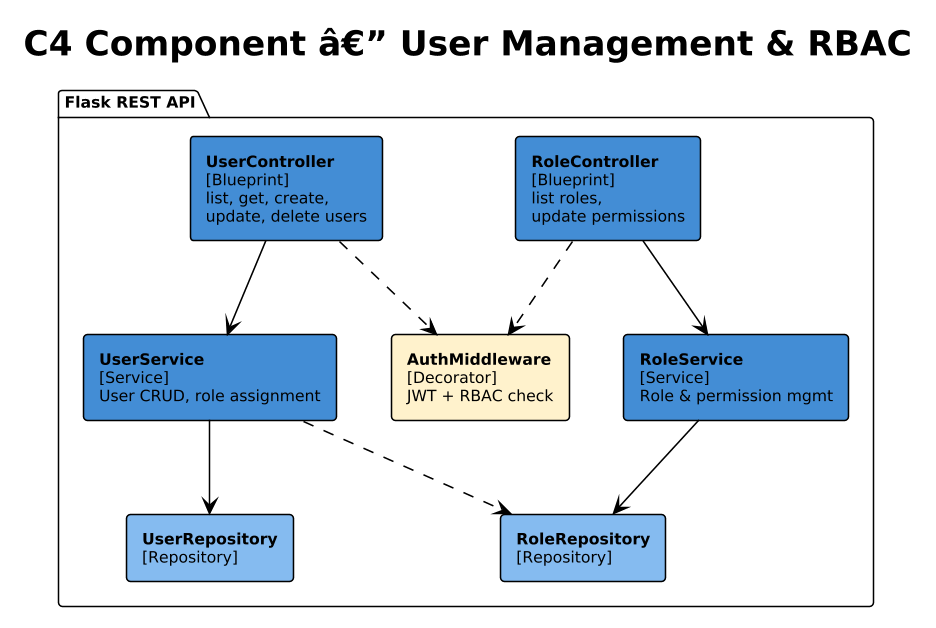
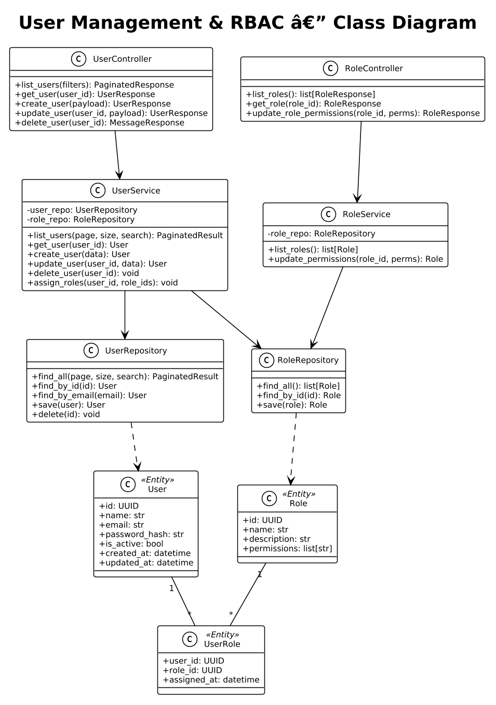
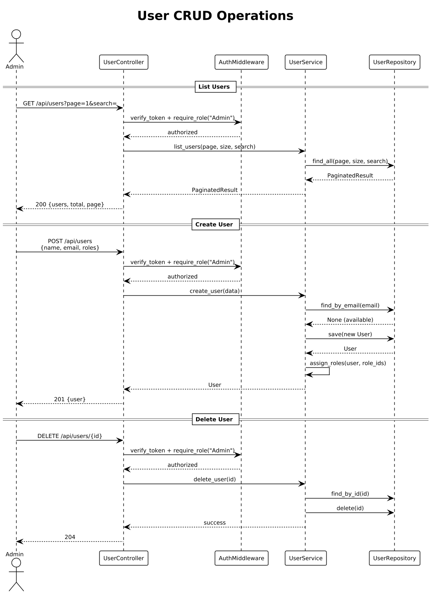

# Module 2: User Management & RBAC

**Requirements**: L1-2, L2-2.1, L2-2.2, L2-2.3, L2-2.4

## Overview

The User Management module provides CRUD operations for users and role-based access control (RBAC). Admins can create, edit, and deactivate users and manage role assignments. Users can hold multiple roles simultaneously (e.g., both Creditor and Borrower).

## C4 Component Diagram

*Source: [diagrams/drawio/c4_component_user.drawio](diagrams/drawio/c4_component_user.drawio)*

## Class Diagram

*Source: [diagrams/plantuml/class_user_rbac.puml](diagrams/plantuml/class_user_rbac.puml)*

## REST API Endpoints

### User Endpoints

| Method | Path | Description | Auth | Role |
|--------|------|-------------|------|------|
| GET | `/api/v1/users` | List users (paginated, searchable) | Bearer | Admin |
| GET | `/api/v1/users/{id}` | Get user by ID | Bearer | Admin |
| POST | `/api/v1/users` | Create user | Bearer | Admin |
| PUT | `/api/v1/users/{id}` | Update user | Bearer | Admin |
| DELETE | `/api/v1/users/{id}` | Delete (deactivate) user | Bearer | Admin |

### Role Endpoints

| Method | Path | Description | Auth | Role |
|--------|------|-------------|------|------|
| GET | `/api/v1/roles` | List all roles | Bearer | Admin |
| GET | `/api/v1/roles/{id}` | Get role with permissions | Bearer | Admin |
| PUT | `/api/v1/roles/{id}/permissions` | Update role permissions | Bearer | Admin |

## Sequence Diagram

### User CRUD Operations

*Source: [diagrams/plantuml/seq_user_crud.puml](diagrams/plantuml/seq_user_crud.puml)*

**Behavior**:
1. All user management endpoints require Admin role, enforced by `AuthMiddleware`.
2. **List Users**: Supports pagination (`page`, `per_page`), search by name/email, and filter by role/status.
3. **Create User**: Validates email uniqueness, creates user with specified roles. Password is either set by admin or a temporary password is generated and emailed.
4. **Update User**: Partial updates supported. Role changes take effect immediately on next token refresh.
5. **Delete User**: Soft-delete (sets `is_active=false`). Does not remove data — loans and payments are preserved for audit.

## RBAC Model

### Roles

| Role | Description | Default Permissions |
|------|-------------|-------------------|
| Admin | System administrator | Full access to all resources |
| Creditor | Loan creator/manager | Create/manage own loans, view borrower details |
| Borrower | Loan recipient | View own loans, make payments, reschedule |

### Permission Enforcement

Permissions are checked at two levels:
1. **Route level**: `@require_role("Admin")` decorator on Flask routes rejects unauthorized access with 403.
2. **Service level**: Business logic validates resource ownership (e.g., a creditor can only edit their own loans).

### Multi-Role Support

Users can hold multiple roles via the `user_roles` junction table. The JWT token includes all assigned roles in its payload. Permission checks use a union model — if any assigned role grants the required permission, access is allowed.

## Data Model

### User Entity

| Column | Type | Constraints |
|--------|------|------------|
| id | UUID | PK |
| name | VARCHAR(255) | NOT NULL |
| email | VARCHAR(255) | NOT NULL, UNIQUE |
| password_hash | VARCHAR(255) | NOT NULL |
| is_active | BOOLEAN | DEFAULT TRUE |
| created_at | TIMESTAMP | NOT NULL, DEFAULT NOW() |
| updated_at | TIMESTAMP | NOT NULL, auto-updated |

### Role Entity

| Column | Type | Constraints |
|--------|------|------------|
| id | UUID | PK |
| name | VARCHAR(50) | NOT NULL, UNIQUE |
| description | VARCHAR(255) | |
| permissions | JSON | Array of permission strings |

### UserRole Junction

| Column | Type | Constraints |
|--------|------|------------|
| user_id | UUID | FK -> users.id, PK |
| role_id | UUID | FK -> roles.id, PK |
| assigned_at | TIMESTAMP | NOT NULL, DEFAULT NOW() |
