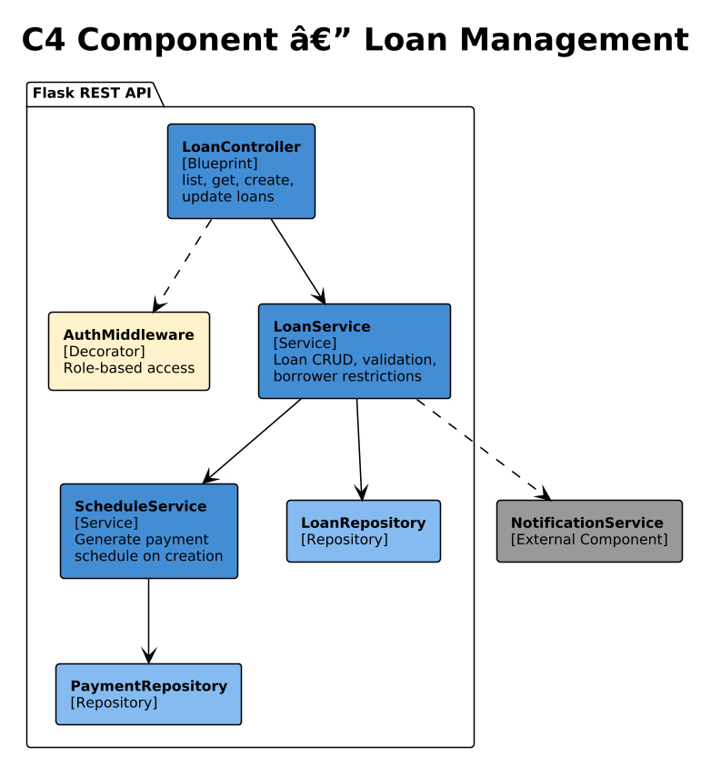
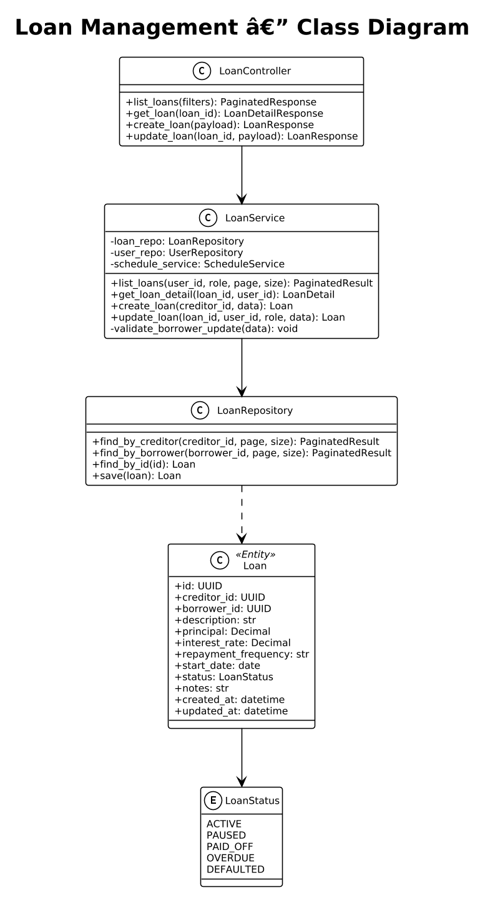
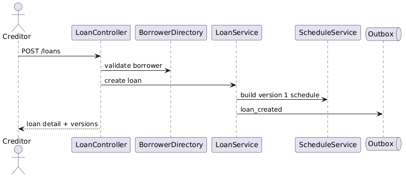
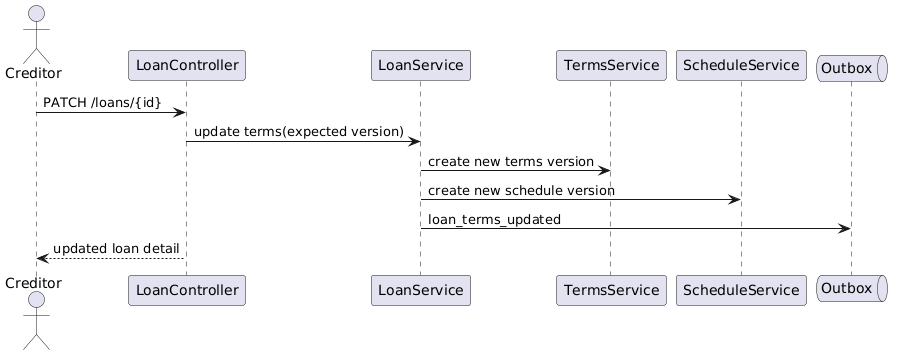

# Module 3: Loan Management

**Requirements**: L1-3, L2-3.1, L2-3.2, L2-3.3, L2-3.4

## Overview

The Loan Management module allows creditors to create and manage loans, and borrowers to view and interact with loans assigned to them. Each loan includes financial terms, a repayment schedule, and status tracking. Borrowers have restricted edit capabilities — they cannot modify the principal amount.

## C4 Component Diagram



*Source: [diagrams/drawio/c4_component_loan.drawio](diagrams/drawio/c4_component_loan.drawio)*

## Class Diagram



*Source: [diagrams/plantuml/class_loan.puml](diagrams/plantuml/class_loan.puml)*

## REST API Endpoints

| Method | Path | Description | Auth | Creditor | Borrower |
|--------|------|-------------|------|----------|----------|
| GET | `/api/v1/loans` | List loans (role-filtered) | Bearer | Own loans | Own loans |
| GET | `/api/v1/loans/{id}` | Get loan detail | Bearer | If owner | If borrower |
| POST | `/api/v1/loans` | Create new loan | Bearer | Yes | No |
| PUT | `/api/v1/loans/{id}` | Update loan | Bearer | All fields | Except principal |

## Sequence Diagrams

### Create Loan



*Source: [diagrams/plantuml/seq_create_loan.puml](diagrams/plantuml/seq_create_loan.puml)*

**Behavior**:
1. Only users with the Creditor role can create loans.
2. The borrower must be a registered user with the Borrower role.
3. On creation, `ScheduleService` generates the full payment schedule based on the repayment frequency, principal, interest rate, and start date.
4. All scheduled payments are persisted with status `SCHEDULED`.
5. The borrower receives a notification about the new loan.

### Update Loan (Role-Based)



*Source: [diagrams/plantuml/seq_update_loan.puml](diagrams/plantuml/seq_update_loan.puml)*

**Behavior**:
1. Creditors can update any field on their own loans.
2. Borrowers can update everything except the `principal` field. Attempting to modify principal returns 403.
3. All field changes are logged in the `ChangeLog` for audit.
4. The counterparty (creditor or borrower) receives a notification of the modification.

## Loan Status Lifecycle

```
ACTIVE --> PAUSED      (creditor/borrower pauses payments)
ACTIVE --> OVERDUE     (payment past due date, system-detected)
ACTIVE --> PAID_OFF    (all payments completed, balance = 0)
PAUSED --> ACTIVE      (resume payments)
OVERDUE --> ACTIVE     (overdue payment recorded)
OVERDUE --> DEFAULTED  (admin action after prolonged non-payment)
```

## Data Model

### Loan Entity

| Column | Type | Constraints |
|--------|------|------------|
| id | UUID | PK |
| creditor_id | UUID | FK -> users.id, NOT NULL |
| borrower_id | UUID | FK -> users.id, NOT NULL |
| description | VARCHAR(500) | NOT NULL |
| principal | DECIMAL(12,2) | NOT NULL, > 0 |
| interest_rate | DECIMAL(5,2) | DEFAULT 0.00 |
| repayment_frequency | VARCHAR(20) | NOT NULL (weekly/biweekly/monthly/custom) |
| start_date | DATE | NOT NULL |
| status | VARCHAR(20) | NOT NULL, DEFAULT 'ACTIVE' |
| notes | TEXT | |
| created_at | TIMESTAMP | NOT NULL |
| updated_at | TIMESTAMP | NOT NULL |

### Schedule Generation Algorithm

For a loan with principal `P`, interest rate `r` (annual), and `n` payments:
1. If `r > 0`: monthly payment = `P * (r/12) / (1 - (1 + r/12)^-n)` (amortization formula)
2. If `r == 0`: monthly payment = `P / n`
3. Dates are computed based on `start_date` + frequency interval for each payment.
