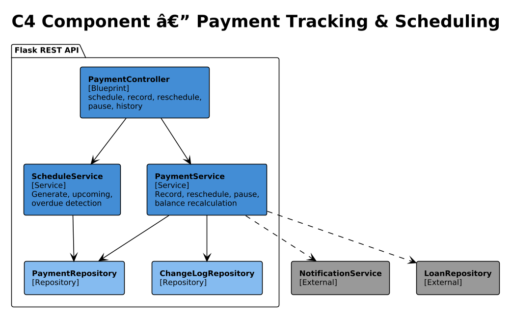
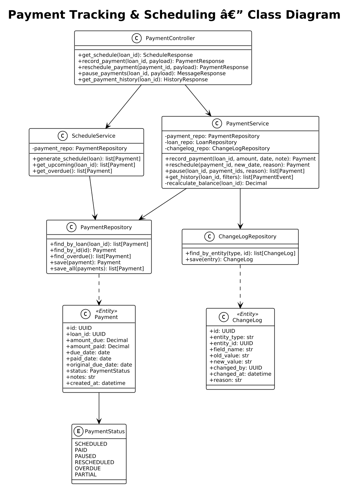

# Module 4: Payment Tracking & Scheduling

**Requirements**: L1-4, L2-4.1, L2-4.2, L2-4.3, L2-4.4, L2-4.5

## Overview

The Payment Tracking module manages the full lifecycle of loan payments: scheduled payment generation, recording actual payments (including lump sums), rescheduling individual payments, pausing payments, and maintaining a complete change history with audit trail.

## C4 Component Diagram



*Source: [diagrams/drawio/c4_component_payment.drawio](diagrams/drawio/c4_component_payment.drawio)*

## Class Diagram



*Source: [diagrams/rendered/class_payment.png](diagrams/rendered/class_payment.png)*

## REST API Endpoints

| Method | Path | Description | Auth |
|--------|------|-------------|------|
| GET | `/api/v1/loans/{id}/schedule` | Get full payment schedule | Bearer |
| POST | `/api/v1/loans/{id}/payments` | Record a payment | Bearer |
| PUT | `/api/v1/payments/{id}/reschedule` | Reschedule a payment | Bearer |
| POST | `/api/v1/loans/{id}/pause` | Pause one or more payments | Bearer |
| GET | `/api/v1/loans/{id}/history` | Get payment history with changes | Bearer |

## Sequence Diagrams

### Record Payment


*Source: [diagrams/rendered/seq_record_payment.png](diagrams/rendered/seq_record_payment.png)*

**Behavior**:
1. User submits a payment with amount, date, and optional notes.
2. The system finds the next due payment for the loan.
3. If the payment amount matches or exceeds the scheduled amount, the payment is marked `PAID`.
4. **Lump sum handling**: If amount exceeds the current payment, excess is applied to subsequent scheduled payments in order until exhausted.
5. The outstanding balance is recalculated.
6. If balance reaches zero, the loan status is updated to `PAID_OFF`.
7. The counterparty receives a payment confirmation notification.

### Reschedule Payment


*Source: [diagrams/rendered/seq_reschedule_payment.png](diagrams/rendered/seq_reschedule_payment.png)*

**Behavior**:
1. User selects a scheduled payment and provides a new date and optional reason.
2. The original due date is preserved in `original_due_date` (for display with strikethrough).
3. The payment status changes to `RESCHEDULED`.
4. A `ChangeLog` entry records the date change and reason.
5. The counterparty is notified of the schedule change.

### Pause Payments


*Source: [diagrams/rendered/seq_pause_payment.png](diagrams/rendered/seq_pause_payment.png)*

**Behavior**:
1. User selects one or more scheduled payments to pause, with an optional reason.
2. Each selected payment status is set to `PAUSED`.
3. Individual `ChangeLog` entries are created for each paused payment.
4. A single notification is sent to the counterparty summarizing the pause.

## Payment Status Lifecycle

```
SCHEDULED --> PAID         (payment recorded, amount >= due)
SCHEDULED --> PARTIAL      (payment recorded, amount < due)
SCHEDULED --> RESCHEDULED  (date changed)
SCHEDULED --> PAUSED       (temporarily suspended)
SCHEDULED --> OVERDUE      (system: past due date, unpaid)
RESCHEDULED --> PAID       (payment recorded)
RESCHEDULED --> OVERDUE    (new date passed, unpaid)
PAUSED --> SCHEDULED       (resume)
PARTIAL --> PAID           (remaining balance paid)
```

## Data Model

### Payment Entity

| Column | Type | Constraints |
|--------|------|------------|
| id | UUID | PK |
| loan_id | UUID | FK -> loans.id, NOT NULL |
| amount_due | DECIMAL(12,2) | NOT NULL |
| amount_paid | DECIMAL(12,2) | DEFAULT 0.00 |
| due_date | DATE | NOT NULL |
| paid_date | DATE | |
| original_due_date | DATE | Set on first reschedule |
| status | VARCHAR(20) | NOT NULL, DEFAULT 'SCHEDULED' |
| notes | TEXT | |
| created_at | TIMESTAMP | NOT NULL |

### ChangeLog Entity

| Column | Type | Constraints |
|--------|------|------------|
| id | UUID | PK |
| entity_type | VARCHAR(50) | NOT NULL (e.g., 'Payment', 'Loan') |
| entity_id | UUID | NOT NULL |
| field_name | VARCHAR(100) | NOT NULL |
| old_value | TEXT | |
| new_value | TEXT | |
| changed_by | UUID | FK -> users.id |
| changed_at | TIMESTAMP | NOT NULL |
| reason | TEXT | |
