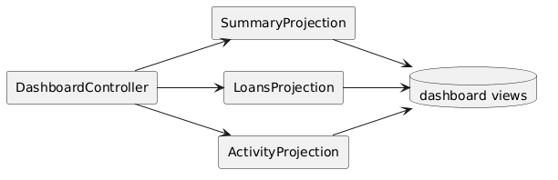
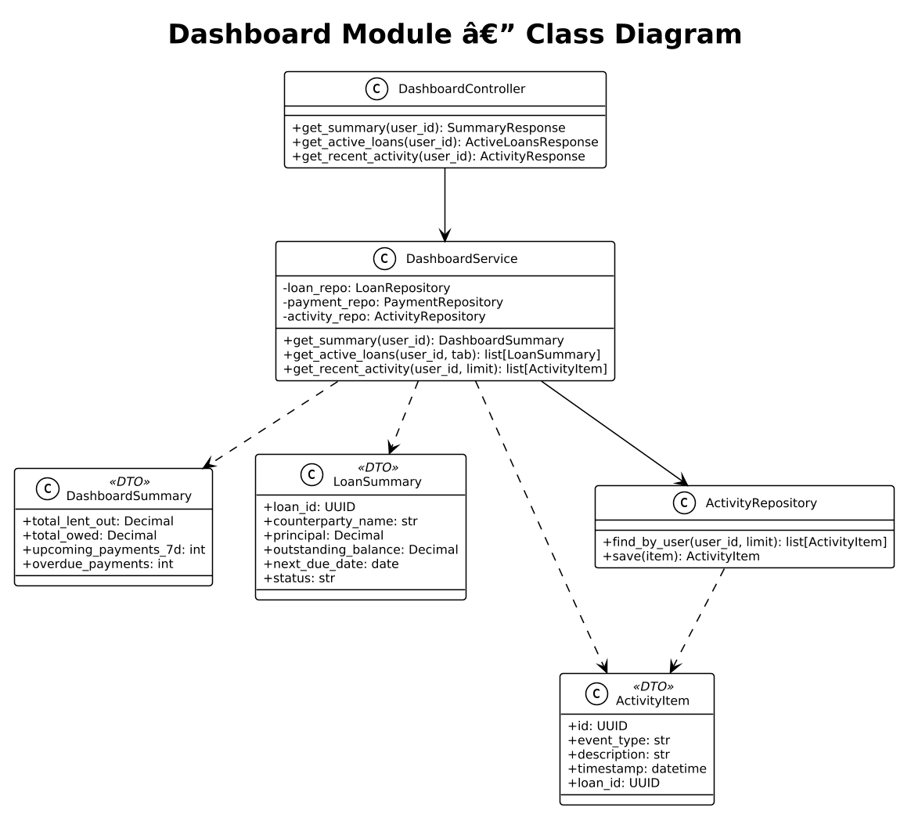
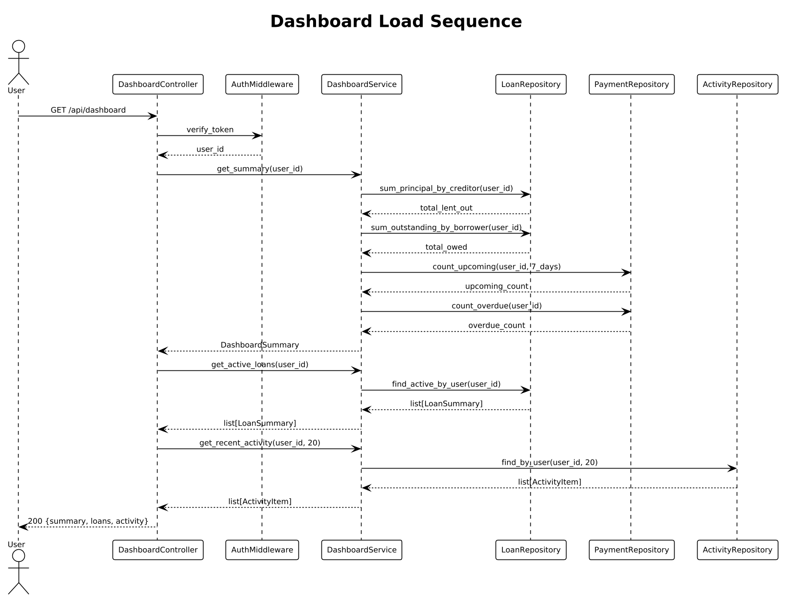

# Module 5: Dashboard

**Requirements**: L1-5, L2-5.1, L2-5.2, L2-5.3

## Overview

The Dashboard module aggregates data from loans, payments, and activity across both creditor and borrower roles for the authenticated user. It provides summary metrics, active loan listings, and a recent activity feed.

## C4 Component Diagram

*Source: [diagrams/drawio/c4_component_dashboard.drawio](diagrams/drawio/c4_component_dashboard.drawio)*

## Class Diagram

*Source: [diagrams/plantuml/class_dashboard.puml](diagrams/plantuml/class_dashboard.puml)*

## REST API Endpoints

| Method | Path | Description | Auth |
|--------|------|-------------|------|
| GET | `/api/v1/dashboard` | Full dashboard payload | Bearer |
| GET | `/api/v1/dashboard/summary` | Summary cards only | Bearer |
| GET | `/api/v1/dashboard/loans?tab=creditor\|borrower` | Active loans by role | Bearer |
| GET | `/api/v1/dashboard/activity?limit=20` | Recent activity feed | Bearer |

## Sequence Diagram

### Dashboard Load

*Source: [diagrams/plantuml/seq_dashboard.puml](diagrams/plantuml/seq_dashboard.puml)*

**Behavior**:
1. The dashboard endpoint aggregates three data sets in a single response.
2. **Summary Cards**:
   - `total_lent_out`: Sum of principal for all active loans where user is creditor.
   - `total_owed`: Sum of outstanding balances for all active loans where user is borrower.
   - `upcoming_payments_7d`: Count of payments due in the next 7 days across all user loans.
   - `overdue_payments`: Count of payments past due across all user loans.
3. **Active Loans**: Filtered by tab (`creditor` or `borrower`). Each entry includes counterparty name, principal, outstanding balance, next due date, and status.
4. **Recent Activity**: Chronological list of events (payments recorded, schedule changes, new loans) limited to the last 20 items.

## Data Model

### DashboardSummary DTO

| Field | Type | Description |
|-------|------|-------------|
| total_lent_out | Decimal | Sum of principal (as creditor) |
| total_owed | Decimal | Sum of outstanding (as borrower) |
| upcoming_payments_7d | int | Payments due within 7 days |
| overdue_payments | int | Overdue payment count |

### ActivityItem Entity

| Column | Type | Constraints |
|--------|------|------------|
| id | UUID | PK |
| user_id | UUID | FK -> users.id, NOT NULL |
| event_type | VARCHAR(50) | NOT NULL |
| description | VARCHAR(500) | NOT NULL |
| loan_id | UUID | FK -> loans.id |
| timestamp | TIMESTAMP | NOT NULL |

Activity items are created as side effects by `LoanService`, `PaymentService`, and `NotificationService` whenever a significant event occurs.
