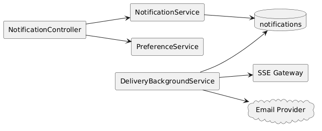
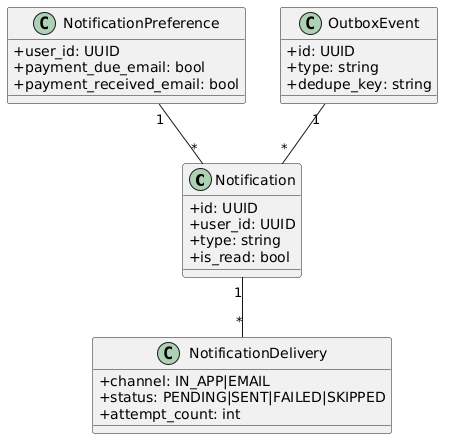
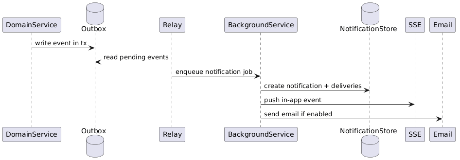

# Module 6: Notifications & Alerts

**Requirements**: L1-6, L1-11, L2-6.1, L2-6.2, L2-6.3, L2-6.4, L2-6.5, L2-11.1

## Overview

The notification module delivers in-app and optional email notifications for loan and payment events. Delivery is event driven, deduplicated, retryable, and trackable. Active browser sessions receive in-app updates over Server-Sent Events rather than badge polling as the primary mechanism.

## C4 Component Diagram

*Source: [diagrams/plantuml/c4_component_notification.puml](diagrams/plantuml/c4_component_notification.puml)*

## Class Diagram

*Source: [diagrams/plantuml/class_notification.puml](diagrams/plantuml/class_notification.puml)*

## Public Endpoints

| Method | Path | Description | Auth |
|---|---|---|---|
| `GET` | `/api/v1/notifications` | List notifications with filters and paging | Bearer |
| `GET` | `/api/v1/notifications/unread-count` | Return unread count | Bearer |
| `POST` | `/api/v1/notifications/{notificationId}/read` | Mark one notification read | Bearer |
| `POST` | `/api/v1/notifications/read-all` | Mark all notifications read | Bearer |
| `GET` | `/api/v1/notifications/stream` | Server-Sent Events stream for active sessions | Bearer |
| `GET` | `/api/v1/notification-preferences` | Load email delivery preferences | Bearer |
| `PUT` | `/api/v1/notification-preferences` | Update email delivery preferences | Bearer |

## Delivery Pipeline

1. Domain services write outbox events when payments post, schedules change, loans are updated, or security events require user communication.
2. An outbox relay publishes jobs to the .NET BackgroundService workers (or Hangfire workers).
3. Worker jobs materialize `notifications`, `notification_deliveries`, and channel-specific attempts.
4. In-app notifications are stored first, then broadcast to active sessions through SSE fan-out.
5. Email delivery is attempted only when the user preference for that category is enabled.

## Data Model

| Entity | Purpose |
|---|---|
| `notifications` | User-visible message, type, read state, related entity references |
| `notification_deliveries` | Channel attempt status such as `PENDING`, `SENT`, `FAILED`, `SKIPPED` |
| `notification_preferences` | Per-user email preference flags by category |
| `outbox_events` | Durable handoff from domain write transactions to worker processing |

## Reliability Rules

- Dedupe key is scoped by source event, user, and channel.
- Worker retries use exponential backoff with dead-letter handling.
- Failed email attempts do not remove the in-app notification.
- Unread count is derived from persisted notification state and can be reconciled on reconnect or page focus.

## Sequence Diagram

*Source: [diagrams/plantuml/seq_notifications.puml](diagrams/plantuml/seq_notifications.puml)*

## Concrete Worker Topology

This design standardizes on .NET BackgroundService workers plus Hangfire Recurring Jobs. In-process timer-based scheduling is not used for production notification delivery.
