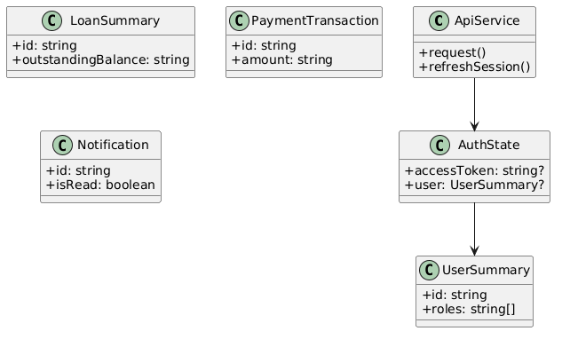
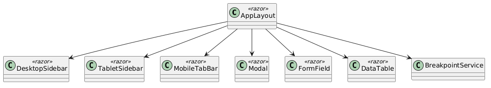
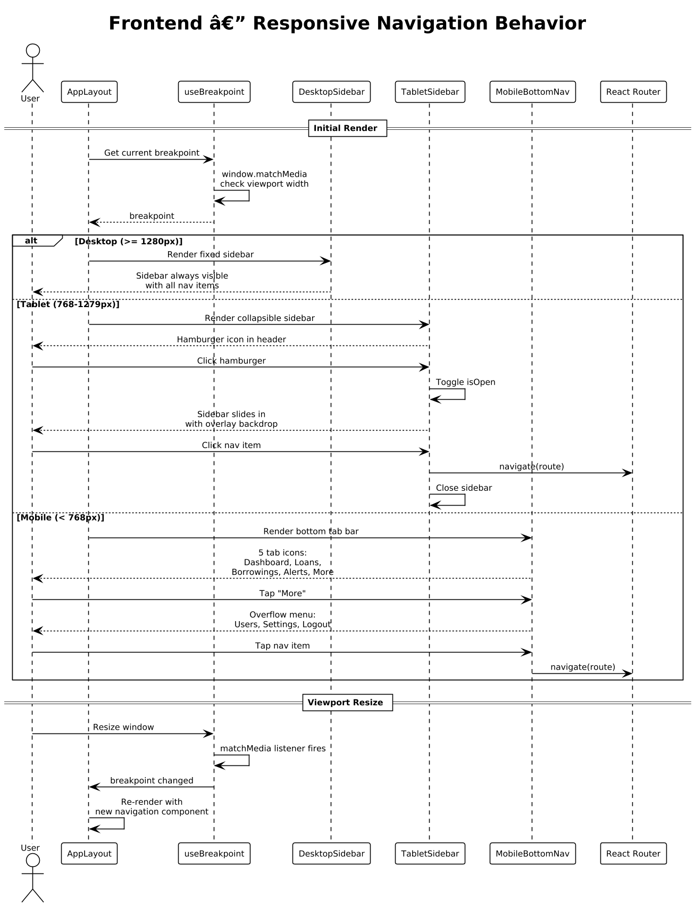
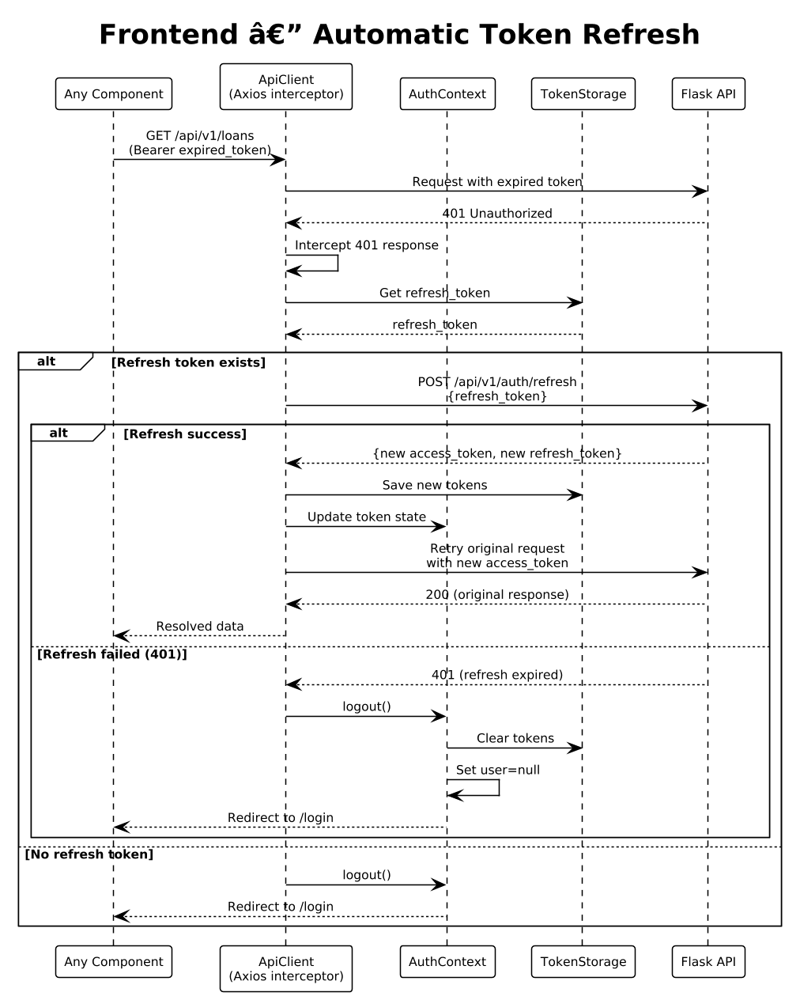

# Module 7: Frontend Architecture

**Requirements**: L1-7, L2-7.1, L2-7.2, L2-7.3

## Overview

The LendQ frontend is a React single-page application (SPA) built with TypeScript. It communicates with the Flask REST API over HTTPS using JWT bearer tokens for authentication. The UI implements the design system defined in `ui-design.pen` with responsive layouts for desktop (1280px+), tablet (768px), and mobile (375px) viewports.

## Technology Stack

| Layer | Technology |
|-------|-----------|
| Language | TypeScript 5.x |
| UI Framework | React 18 |
| Build Tool | Vite |
| Routing | React Router 6 |
| Server State | TanStack Query (React Query) 5 |
| HTTP Client | Axios |
| Styling | Tailwind CSS 3 |
| Icons | Lucide React |
| Forms | React Hook Form + Zod |
| Date Handling | date-fns |
| Testing | Vitest + React Testing Library |

## C4 Container Diagram (Full-Stack)


*Source: [diagrams/plantuml/fe_c4_container.puml](diagrams/plantuml/fe_c4_container.puml) | [diagrams/drawio/fe_c4_container.drawio](diagrams/drawio/fe_c4_container.drawio)*

The React SPA runs entirely in the browser. It fetches data from the Flask REST API via JSON over HTTPS, authenticating with JWT bearer tokens. The backend handles all business logic, database access, and email dispatch.

## C4 Component Diagram (SPA Internals)


*Source: [diagrams/plantuml/fe_c4_component_spa.puml](diagrams/plantuml/fe_c4_component_spa.puml)*

### Internal Architecture

The SPA is organized into feature modules, each containing pages, components, and hooks:

| Layer | Responsibility |
|-------|---------------|
| **App Shell** | Root layout, responsive navigation (sidebar/bottom nav), routing |
| **Feature Modules** | Auth, Dashboard, Loans, Payments, Users, Notifications |
| **Shared UI** | Reusable components: Button, Input, Modal, DataTable, Badge, etc. |
| **API Client** | Axios instance with auth interceptors, token refresh logic |
| **Auth Context** | React context providing user state, roles, login/logout |
| **TanStack Query** | Server state caching, mutations with optimistic updates, cache invalidation |

## Project Structure

```
src/
  api/
    client.ts              # Axios instance, interceptors
    types.ts               # Shared API types (User, Loan, Payment, etc.)
  auth/
    AuthContext.tsx         # Auth provider, login/logout/refresh
    ProtectedRoute.tsx     # Role-based route guard
    LoginPage.tsx
    SignUpPage.tsx
    ForgotPasswordPage.tsx
    ResetPasswordPage.tsx
  dashboard/
    DashboardPage.tsx
    SummaryCards.tsx
    ActiveLoansPanel.tsx
    ActivityFeed.tsx
    hooks.ts               # useDashboardSummary, useDashboardLoans, etc.
  loans/
    LoanListPage.tsx
    LoanDetailPage.tsx
    CreateEditLoanModal.tsx
    LoanTable.tsx
    LoanCardList.tsx
    hooks.ts
  payments/
    PaymentScheduleView.tsx
    RecordPaymentDialog.tsx
    ReschedulePaymentDialog.tsx
    PausePaymentDialog.tsx
    PaymentHistoryView.tsx
    hooks.ts
  users/
    UserListPage.tsx
    AddEditUserDialog.tsx
    DeleteUserDialog.tsx
    RoleManagementPage.tsx
    UserTable.tsx
    hooks.ts
  notifications/
    NotificationBell.tsx
    NotificationDropdown.tsx
    NotificationListPage.tsx
    ToastProvider.tsx
    ToastContainer.tsx
    hooks.ts
  ui/
    Button.tsx
    Input.tsx
    Select.tsx
    Textarea.tsx
    Modal.tsx
    DataTable.tsx
    Badge.tsx
    Card.tsx
    SearchInput.tsx
    DatePicker.tsx
    CurrencyInput.tsx
    Pagination.tsx
    EmptyState.tsx
  layout/
    AppLayout.tsx
    DesktopSidebar.tsx
    TabletSidebar.tsx
    MobileBottomNav.tsx
    useBreakpoint.ts
  App.tsx
  main.tsx
  routes.tsx
```

## Routing

| Path | Page | Auth | Roles |
|------|------|------|-------|
| `/login` | LoginPage | No | — |
| `/signup` | SignUpPage | No | — |
| `/forgot-password` | ForgotPasswordPage | No | — |
| `/reset-password/:token` | ResetPasswordPage | No | — |
| `/dashboard` | DashboardPage | Yes | Any |
| `/loans` | LoanListPage | Yes | Creditor, Borrower |
| `/loans/new` | CreateEditLoanModal | Yes | Creditor |
| `/loans/:id` | LoanDetailPage | Yes | Creditor, Borrower |
| `/loans/:id/edit` | CreateEditLoanModal | Yes | Creditor, Borrower* |
| `/users` | UserListPage | Yes | Admin |
| `/users/roles` | RoleManagementPage | Yes | Admin |
| `/notifications` | NotificationListPage | Yes | Any |
| `/settings` | SettingsPage | Yes | Any |

*Borrowers cannot modify principal amount.

## Class Diagram — Core Types & API Client



*Source: [diagrams/plantuml/fe_class_api_types.puml](diagrams/plantuml/fe_class_api_types.puml)*

### Key TypeScript Types

```typescript
// Enums
type LoanStatus = "ACTIVE" | "PAUSED" | "PAID_OFF" | "OVERDUE" | "DEFAULTED";
type PaymentStatus = "SCHEDULED" | "PAID" | "PAUSED" | "RESCHEDULED" | "OVERDUE" | "PARTIAL";
type NotificationType = "PAYMENT_DUE" | "PAYMENT_OVERDUE" | "PAYMENT_RECEIVED" | "SCHEDULE_CHANGED" | "LOAN_MODIFIED" | "SYSTEM";
type RepaymentFrequency = "WEEKLY" | "BIWEEKLY" | "MONTHLY" | "CUSTOM";

// Paginated response wrapper (matches backend convention)
interface PaginatedResponse<T> {
  items: T[];
  total: number;
  page: number;
  per_page: number;
  pages: number;
}

// API error shape
interface ApiError {
  error: string;
  code: string;
  details?: Record<string, string[]>;
}
```

### API Client

The `ApiClient` is a configured Axios instance with two interceptors:

1. **Request interceptor**: Attaches the JWT access token from `localStorage` as a `Bearer` header on every request.
2. **Response interceptor**: On 401 responses, attempts a token refresh via `POST /api/v1/auth/refresh`. If refresh succeeds, the original request is retried with the new token. If refresh fails, the user is logged out and redirected to `/login`.

## Class Diagram — Responsive Layout & Shared UI



*Source: [diagrams/plantuml/fe_class_layout.puml](diagrams/plantuml/fe_class_layout.puml)*

### Responsive Navigation Strategy

Derived from `ui-design.pen`:

| Breakpoint | Navigation | Design Reference |
|------------|-----------|-----------------|
| Desktop (>= 1280px) | Fixed left sidebar (280px) with logo, nav items, user avatar | `Dashboard - Desktop` screen — `Sidebar` frame |
| Tablet (768–1279px) | Top header with hamburger toggle, collapsible sidebar overlay | `Dashboard - Tablet (768px)` screen — `tHeader` frame |
| Mobile (< 768px) | Top header + bottom tab bar (Home, Loans, Owed, Alerts, More) | `Dashboard - Mobile (375px)` screen — `Mobile Bottom Tab Bar` frame |

The `useBreakpoint` hook listens to `window.matchMedia` and exposes `isMobile`, `isTablet`, `isDesktop`, and `breakpoint` values. `AppLayout` renders the appropriate navigation component based on the current breakpoint.

### Navigation Items

From the sidebar in `ui-design.pen`:

| Icon | Label | Route | Mobile Tab |
|------|-------|-------|-----------|
| `layout-dashboard` | Dashboard | `/dashboard` | Home |
| `banknote` | My Loans | `/loans?view=creditor` | Loans |
| `hand-coins` | Borrowings | `/loans?view=borrower` | Owed |
| `users` | Users | `/users` | (More menu) |
| `bell` | Notifications | `/notifications` | Alerts |
| `settings` | Settings | `/settings` | (More menu) |

### Design System — Shared UI Components

Mapped from the `Design System` frame in `ui-design.pen`:

| Component | Variants | Design Tokens |
|-----------|----------|--------------|
| **Button** | Primary (`#FF6B6B` bg, white text), Secondary (`#F6F7F8` bg, `#E5E7EB` border), Destructive (`#FEE2E2` bg, `#DC2626` text), Ghost (transparent, no border) | `cornerRadius: 12`, `padding: 12px 24px`, min 44px touch target on mobile |
| **InputGroup** | Text input with optional leading icon, label above, error state below | `cornerRadius: 12`, `font: DM Sans 14px` |
| **Select** | Dropdown with chevron icon, label above | Same tokens as InputGroup |
| **Textarea** | Multi-line input with label | Same tokens as InputGroup |
| **Badge** | Active (`#DCFCE7` bg, `#16A34A` text), Overdue (`#FEE2E2` bg, `#DC2626` text), Paused (`#FFFBEB` bg, `#CA8A04` text), PaidOff (`#F0F5FF` bg, `#2563EB` text) | `cornerRadius: 12`, `padding: 4px 12px` |
| **Card** | White bg, `#F3F4F6` border, `cornerRadius: 16` | Used for metric cards, table wrappers, content sections |
| **MetricCard** | Icon circle (`#FFF1F0` bg), label, value | `cornerRadius: 16`, `padding: 20px`, `width: 280px` (flex in grid) |
| **Modal** | Header (title + close X), scrollable body, footer (cancel + action buttons) | `cornerRadius: 20`, `width: 420–520px` desktop, full-screen mobile, shadow |
| **NavItem** | Active (`#FFF1F0` bg), Default (transparent) | `cornerRadius: 12`, `padding: 10px 16px`, Lucide icons |
| **Toast** | Success (`#DCFCE7` border), Error (`#FEE2E2` border), Warning (`#FFFBEB` border) | `cornerRadius: 12`, `width: 360px`, shadow, auto-dismiss 5s |

### Typography

From `ui-design.pen`:

| Usage | Font Family | Weight | Size |
|-------|------------|--------|------|
| Headings, brand, values | Bricolage Grotesque | 700–800 | 18–48px |
| Body, labels, descriptions | DM Sans | 400–600 | 12–15px |

### Color Palette

| Token | Hex | Usage |
|-------|-----|-------|
| Primary | `#FF6B6B` | Buttons, active nav, brand accent |
| Primary Light | `#FFF1F0` | Active nav bg, icon bg |
| Background | `#F6F7F8` / `#F9FAFB` | Page background |
| Surface | `#FFFFFF` | Cards, modals, sidebar |
| Border | `#F3F4F6` / `#E5E7EB` | Card borders, dividers |
| Text Primary | `#1A1A1A` | Headings |
| Text Secondary | `#6B7280` | Subtitles, labels |
| Text Muted | `#9CA3AF` | Placeholders, close icons |
| Success | `#DCFCE7` / `#16A34A` | Active badges, success toasts |
| Danger | `#FEE2E2` / `#DC2626` | Overdue badges, error toasts, destructive buttons |
| Warning | `#FFFBEB` / `#CA8A04` | Paused badges, warning toasts |
| Info | `#F0F5FF` / `#2563EB` | PaidOff badges |

## Sequence Diagram — Responsive Navigation



*Source: [diagrams/plantuml/fe_seq_responsive_nav.puml](diagrams/plantuml/fe_seq_responsive_nav.puml)*

**Behavior**:
1. On initial render, `useBreakpoint` checks the viewport width via `window.matchMedia`.
2. Desktop: renders `DesktopSidebar` as a fixed left column (280px) with all nav items always visible.
3. Tablet: renders a top header with a hamburger icon. Clicking it slides in a sidebar overlay with a backdrop.
4. Mobile: renders a top header (logo + bell + avatar) and a bottom tab bar with 5 tabs: Home, Loans, Owed, Alerts, More. The "More" tab opens an overflow menu for Users, Settings, and Logout.
5. On viewport resize, the `matchMedia` listener fires and `AppLayout` re-renders with the appropriate navigation component.

## Sequence Diagram — Token Refresh



*Source: [diagrams/plantuml/fe_seq_token_refresh.puml](diagrams/plantuml/fe_seq_token_refresh.puml)*

**Behavior**:
1. When any API request receives a 401, the Axios response interceptor intercepts it.
2. The interceptor retrieves the refresh token from `localStorage`.
3. If a refresh token exists, it calls `POST /api/v1/auth/refresh`.
4. On success, new tokens are saved and the original request is retried with the new access token.
5. On failure (refresh token expired) or if no refresh token exists, the user is logged out, tokens are cleared, and the app navigates to `/login`.
6. Concurrent 401s are queued — only one refresh request is made, and all queued requests are retried with the new token.
