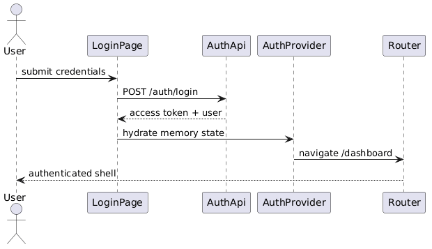

# Module 8: Frontend — Authentication

**Requirements**: L1-1, L2-1.1, L2-1.2, L2-1.3

**Backend API**: [01-authentication.md](01-authentication.md)

## Overview

The frontend authentication module implements the login, sign-up, and forgot-password screens as designed in `ui-design.pen`. It provides an `AuthContext` that manages JWT token storage, user state, role information, and automatic token refresh. All authenticated routes are guarded by `ProtectedRoute`, which enforces authentication and optional role checks.

## Class Diagram


*Source: [diagrams/plantuml/fe_class_auth.puml](diagrams/plantuml/fe_class_auth.puml)*

## Screen Designs (from ui-design.pen)

### Login Screen — Desktop

**Design reference**: `Login Screen - Desktop` (1440 x 900)

| Element | Design Details |
|---------|---------------|
| **Layout** | Two-panel split: left brand panel (`#FF6B6B` bg, centered), right form panel (white bg, centered) |
| **Left Panel** | Lucide `landmark` icon (48px white), "LendQ" (Bricolage Grotesque 48px 800-weight white), tagline "Family lending made simple" (`#FFFFFFCC`, DM Sans 18px) |
| **Right Panel** | "Welcome back" (Bricolage Grotesque 32px 700-weight), subtitle "Sign in to manage your loans" (`#6B7280`, DM Sans 15px) |
| **Email Input** | `InputGroup` component with `mail` icon, label "Email Address", placeholder "you@example.com" |
| **Password Input** | `InputGroup` component with `lock` icon, label "Password", placeholder "Enter your password" |
| **Remember Row** | Checkbox "Remember me" (left) + "Forgot Password?" link in `#FF6B6B` (right) |
| **Sign In Button** | Primary button, full-width, text "Sign In" |
| **Divider** | "or" text between horizontal rules |
| **Sign Up Row** | "Don't have an account?" + "Sign Up" link in `#FF6B6B` |

**Responsive behavior**:
- Tablet: left panel hidden, form centered with padding
- Mobile: single-column, logo above form, full-width inputs

### Sign-Up Screen — Desktop

**Design reference**: `Sign Up Screen - Desktop` (1440 x 900)

| Element | Design Details |
|---------|---------------|
| **Layout** | Same two-panel split as login |
| **Left Panel** | Same brand styling, tagline "Track family loans with ease" |
| **Title** | "Create your account" |
| **Subtitle** | "Join your family's lending circle" |
| **Form Fields** | `InputGroup` components: Full Name (`user` icon), Email (`mail` icon), Password (`lock` icon), Confirm Password (`shield-check` icon) |
| **Create Button** | Primary button, full-width, text "Create Account" |
| **Sign In Row** | "Already have an account?" + "Sign In" link |

### Forgot Password Screen — Desktop

**Design reference**: `Forgot Password Screen - Desktop` (1440 x 900)

| Element | Design Details |
|---------|---------------|
| **Layout** | Same two-panel split |
| **Left Panel** | Same brand styling, tagline "We'll help you get back in" |
| **Title** | "Reset your password" |
| **Subtitle** | "Enter your email and we'll send you a reset link" |
| **Email Input** | `InputGroup` with `mail` icon, label "Email Address" |
| **Reset Button** | Primary button, full-width, text "Send Reset Link" |
| **Back Row** | "Remember your password?" + "Back to Login" link |

**Post-submit state**: Form replaced with success message confirming reset link sent.

## API Integration

| Action | API Endpoint | Request | Response |
|--------|-------------|---------|----------|
| Login | `POST /api/v1/auth/login` | `{email, password}` | `{access_token, refresh_token, token_type, expires_in}` |
| Sign Up | `POST /api/v1/auth/signup` | `{name, email, password, confirm_password}` | `User` (201) |
| Forgot Password | `POST /api/v1/auth/forgot-password` | `{email}` | `{message}` (200 always) |
| Reset Password | `POST /api/v1/auth/reset-password` | `{token, password, confirm_password}` | `{message}` (200) |
| Refresh Token | `POST /api/v1/auth/refresh` | `{refresh_token}` | `{access_token, refresh_token}` |
| Logout | `POST /api/v1/auth/logout` | — | 204 |

## Sequence Diagram — Login Flow



*Source: [diagrams/plantuml/fe_seq_login.puml](diagrams/plantuml/fe_seq_login.puml)*

**Behavior**:
1. User enters email and password on the `LoginPage` and clicks "Sign In".
2. Client-side validation checks for required fields. If validation fails, inline errors are shown.
3. `LoginPage` calls `auth.login(email, password)` from `AuthContext`.
4. `AuthContext` sends `POST /api/v1/auth/login` via `ApiClient`.
5. On success (200): tokens are saved to `localStorage`, a follow-up `GET /api/v1/users/me` fetches the user profile and roles, `isAuthenticated` is set to `true`, and React Router navigates to `/dashboard`.
6. On 401 error: an error toast is shown — "Invalid email or password".
7. On network error: an error toast is shown — "Connection failed. Please try again."

## AuthContext Provider

```typescript
interface AuthContextValue {
  user: User | null;
  roles: string[];
  isAuthenticated: boolean;
  isLoading: boolean;
  login(email: string, password: string): Promise<void>;
  signup(data: SignUpRequest): Promise<void>;
  logout(): void;
  refreshToken(): Promise<void>;
}
```

**Initialization**: On app mount, `AuthContext` checks `localStorage` for an existing access token. If found, it attempts to fetch the user profile (`GET /api/v1/users/me`). If the token is expired, the refresh flow is triggered automatically. If refresh fails, the user is logged out.

**Role checks**: The `roles` array contains all roles assigned to the user (e.g., `["Creditor", "Borrower"]`). Components and routes use this for conditional rendering and access control.

## ProtectedRoute Component

```typescript
interface ProtectedRouteProps {
  requiredRoles?: string[];  // e.g., ["Admin"]
  children: ReactNode;
}
```

**Behavior**:
- If `isAuthenticated` is `false` and `isLoading` is `false`, redirects to `/login` with the current path as a `returnTo` query parameter.
- If `requiredRoles` is specified and the user's roles do not include any of them, redirects to a 403 forbidden page.
- While `isLoading` is `true`, renders a loading spinner.

## Form Validation (React Hook Form + Zod)

### Login Schema

| Field | Rules |
|-------|-------|
| email | Required, valid email format |
| password | Required, min 1 character |

### Sign-Up Schema

| Field | Rules |
|-------|-------|
| name | Required, min 2 characters |
| email | Required, valid email format |
| password | Required, min 8 characters |
| confirm_password | Required, must match `password` |

### Forgot Password Schema

| Field | Rules |
|-------|-------|
| email | Required, valid email format |

### Error Display

- **Inline errors**: Shown below each field in red text when validation fails on submit.
- **API errors**:
  - 401 on login: generic "Invalid email or password" toast (no field-level detail, matching backend's anti-enumeration design).
  - 409 on signup: "An account with this email already exists" shown inline on the email field.
  - Network errors: toast notification.

## Token Storage

| Key | Storage | Content |
|-----|---------|---------|
| `lendq_access_token` | `localStorage` | JWT access token (15 min TTL) |
| `lendq_refresh_token` | `localStorage` | JWT refresh token (7 day TTL) |

Tokens are cleared on logout or when refresh fails.
