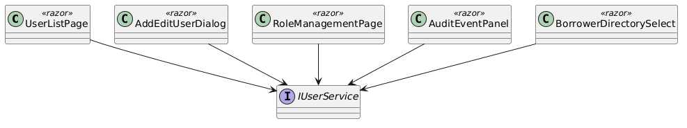
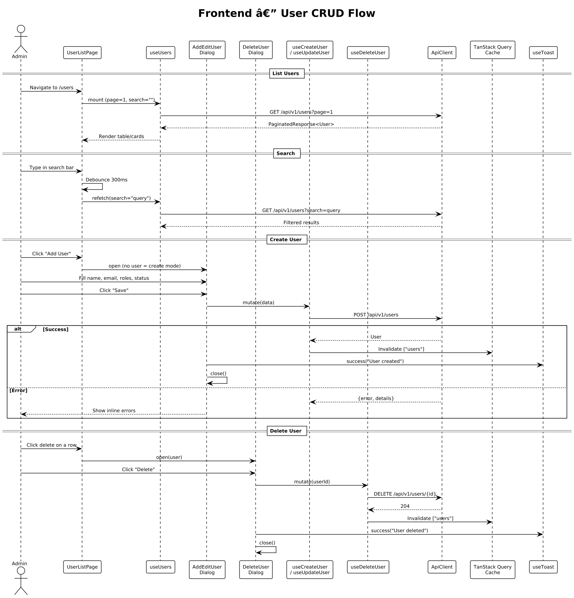

# Module 9: Frontend — User Management & RBAC

**Requirements**: L1-2, L2-2.1, L2-2.2, L2-2.3, L2-2.4

**Backend API**: [02-user-management.md](02-user-management.md)

## Overview

The frontend user management module provides Admin-only screens for listing, creating, editing, and deleting users, as well as managing roles and permissions. The screens adapt responsively: a data table on desktop/tablet and card-based layout on mobile. All user CRUD operations are performed through modal dialogs.

## Class Diagram

*Source: [diagrams/rendered/fe_class_user.png](diagrams/rendered/fe_class_user.png)*

## Screen Designs (from ui-design.pen)

### User Management Screen — Desktop

**Design reference**: `User Management - Desktop` (1440px)

| Element | Design Details |
|---------|---------------|
| **Layout** | Standard app shell: sidebar (280px, `Users` nav active with `#FFF1F0` bg) + main content area (`#F6F7F8` bg, 32px padding) |
| **Header** | Left: "User Management" (Bricolage Grotesque 24px 700-weight) + subtitle "Manage users and roles" (`#6B7280`). Right: Primary button "Add User" with `user-plus` icon |
| **Table Card** | White card (`cornerRadius: 16`, `#F3F4F6` border) containing search bar and data table |
| **Search Bar** | `SearchInput` with `search` icon and "Search users..." placeholder, debounced 300ms |
| **Table Header** | Columns: Name, Email, Roles, Status, Actions — all in `#6B7280` DM Sans 12px 600-weight uppercase |
| **Table Rows** | Name (DM Sans 14px 500-weight `#1A1A1A`) + email below (`#6B7280` 13px), Role badges (multiple per user), Status badge (Active=green, Inactive=gray), Action buttons: Edit (`pencil` icon) + Delete (`trash-2` icon, `#DC2626`) |
| **Pagination** | Below table with page numbers |

**Responsive behavior**:
- Tablet: same table with horizontal scroll if needed
- Mobile: card-based list — each card shows name, email, role badges, status badge, and edit/delete icon buttons

### Add/Edit User Modal

**Design reference**: `Add/Edit User Modal` (480px width)

| Element | Design Details |
|---------|---------------|
| **Header** | "Add New User" or "Edit User" (Bricolage Grotesque 18px 700-weight) + close `x` icon (`#9CA3AF`) |
| **Divider** | Bottom border `#F3F4F6` 1px |
| **Full Name** | `InputGroup` with `user` icon, placeholder "Enter full name" |
| **Email Address** | `InputGroup` with `mail` icon, placeholder "user@family.com" |
| **Roles** | `Select` component, label "Role", with options: Admin, Creditor, Borrower (multi-select via checkboxes) |
| **Active Toggle** | Row: label "Active Status" + description "User can sign in and access the system" + toggle switch |
| **Footer** | Right-aligned: Ghost "Cancel" button + Primary "Save User" button |
| **Shadow** | `blur: 32, color: #0000001A, offset: y=8` |
| **Corner Radius** | 20px |

**Responsive**: Full-screen modal on mobile, centered overlay on desktop/tablet.

### Delete User Confirmation Modal

**Design reference**: `Delete User Confirmation` (420px width)

| Element | Design Details |
|---------|---------------|
| **Icon** | Centered `trash-2` icon in circular `#FEE2E2` bg (56px) |
| **Title** | "Delete User?" (Bricolage Grotesque 20px 700-weight, centered) |
| **Message** | "Are you sure you want to delete [user name]? This action cannot be undone." (`#6B7280`, DM Sans 14px, centered, 320px max-width) |
| **Footer** | Right-aligned: Ghost "Cancel" button + Destructive "Delete" button with `trash-2` icon |

## API Integration

| Action | Hook | API Endpoint | Cache Invalidation |
|--------|------|-------------|-------------------|
| List users | `useUsers(page, search)` | `GET /api/v1/users?page=&search=` | — |
| Create user | `useCreateUser` | `POST /api/v1/users` | Invalidates `["users"]` |
| Update user | `useUpdateUser` | `PUT /api/v1/users/{id}` | Invalidates `["users"]` |
| Delete user | `useDeleteUser` | `DELETE /api/v1/users/{id}` | Invalidates `["users"]` |
| List roles | `useRoles` | `GET /api/v1/roles` | — |
| Update permissions | `useUpdatePermissions` | `PUT /api/v1/roles/{id}/permissions` | Invalidates `["roles"]` |

## Sequence Diagram — User CRUD

*Source: [diagrams/rendered/fe_seq_user_crud.png](diagrams/rendered/fe_seq_user_crud.png)*

**Behavior**:

### List Users
1. Admin navigates to `/users`. The `UserListPage` mounts and `useUsers` fires a query for page 1.
2. TanStack Query checks the cache for `["users", {page: 1, search: ""}]`. On cache miss, it calls `GET /api/v1/users?page=1`.
3. Results render in `UserTable` (desktop/tablet) or `UserCardList` (mobile).

### Search
1. Admin types in the search bar. After a 300ms debounce, `useUsers` refetches with the search query.
2. Results update in-place.

### Create User
1. Admin clicks "Add User". `AddEditUserDialog` opens in create mode (no `user` prop).
2. Admin fills name, email, selects role(s), sets active toggle, and clicks "Save User".
3. `useCreateUser.mutate(data)` sends `POST /api/v1/users`.
4. On success: cache invalidation triggers a refetch of the users list, a success toast is shown ("User created"), and the dialog closes.
5. On error (409 email conflict): inline error "A user with this email already exists" appears on the email field.
6. On error (422 validation): inline errors from `details` are mapped to form fields.

### Edit User
1. Admin clicks the edit icon on a table row. `AddEditUserDialog` opens with the user data pre-populated.
2. Admin modifies fields and clicks "Save User".
3. `useUpdateUser.mutate(id, data)` sends `PUT /api/v1/users/{id}`.
4. On success: cache invalidated, toast "User updated", dialog closes.

### Delete User
1. Admin clicks the delete icon. `DeleteUserDialog` opens showing the user's name.
2. Admin clicks "Delete". `useDeleteUser.mutate(id)` sends `DELETE /api/v1/users/{id}`.
3. On success: cache invalidated, toast "User deleted", dialog closes.
4. The user is soft-deleted (set `is_active=false`) on the backend — loans and payments are preserved.

## Form Validation

### Add/Edit User Schema (Zod)

| Field | Rules |
|-------|-------|
| name | Required, min 2 characters, max 255 |
| email | Required, valid email format |
| roles | Required, at least one role selected |
| is_active | Boolean, defaults to `true` on create |

## Access Control

- All user management routes are wrapped in `<ProtectedRoute requiredRoles={["Admin"]}>`.
- If a non-admin user navigates to `/users`, they are redirected to a 403 page.
- The "Users" nav item is conditionally rendered in the sidebar/bottom nav only for users with the Admin role.

## Role Management Page

**Route**: `/users/roles`

Displays a list of the three roles (Admin, Creditor, Borrower) with their descriptions and current permissions shown as tag chips. Admins can click a role to open `RolePermissionEditor`, which allows toggling individual permissions and saving via `PUT /api/v1/roles/{id}/permissions`.
