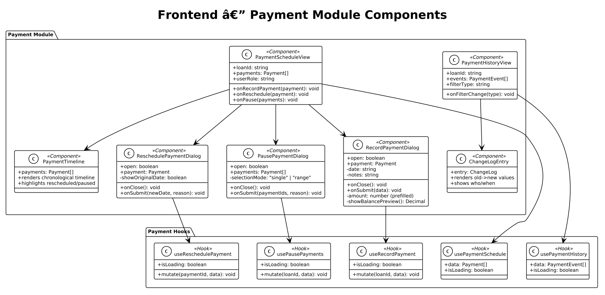
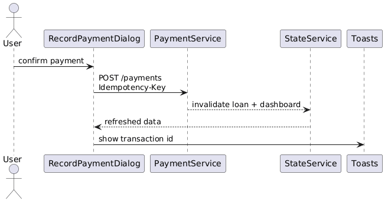

# Module 11: Frontend — Payment Tracking & Scheduling

**Requirements**: L1-4, L2-4.1, L2-4.2, L2-4.3, L2-4.4, L2-4.5

**Backend API**: [04-payment-tracking.md](04-payment-tracking.md)

## Overview

The frontend payment module provides UI components for displaying the payment schedule, recording payments (including lump sums), rescheduling individual payments, pausing payments, and viewing the full payment history with change log. These components are embedded within the Loan Detail page and triggered via modal dialogs.

## Class Diagram

*Source: [diagrams/rendered/fe_class_payment.png](diagrams/rendered/fe_class_payment.png)*

## Screen Designs (from ui-design.pen)

### Record Payment Modal

**Design reference**: `Record Payment Modal` (460px width)

| Element | Design Details |
|---------|---------------|
| **Header** | "Record Payment" (Bricolage Grotesque 18px 700-weight) + close `x` icon |
| **Scheduled Info** | Gray info row (`#F6F7F8` bg, `cornerRadius: 12`): Shows "Scheduled Payment" label with due date and amount due in a compact display |
| **Payment Amount** | `InputGroup` with `dollar-sign` icon, label "Payment Amount", pre-filled with the scheduled `amount_due` (editable for lump sum) |
| **Row** | Two fields side-by-side: Payment Date (`InputGroup` with `calendar` icon) + Payment Method (`Select` — Cash, Bank Transfer, Other) |
| **Balance Preview** | Green info row (`#F0FDF4` bg, `cornerRadius: 12`): "Remaining Balance" label on left, calculated value on right (outstanding - amount), updates live as amount changes |
| **Notes** | `InputGroup` with `file-text` icon, label "Notes (optional)", placeholder "Any additional notes" |
| **Footer** | Right-aligned: Ghost "Cancel" + Primary "Record Payment" button with `check` icon |

### Reschedule Payment Modal

**Design reference**: `Reschedule Payment Modal` (460px width)

| Element | Design Details |
|---------|---------------|
| **Header** | "Reschedule Payment" (Bricolage Grotesque 18px 700-weight) + close `x` icon |
| **Current Payment Info** | Gray info row (`#F6F7F8` bg, `cornerRadius: 12`): Shows current due date and amount with `calendar` and `dollar-sign` labels |
| **New Payment Date** | `InputGroup` with `calendar` icon, label "New Payment Date", placeholder "Select new date" |
| **Reason** | `Textarea` with label "Reason (optional)", placeholder "Why is this payment being rescheduled?" |
| **Footer** | Right-aligned: Ghost "Cancel" + Primary "Reschedule" button with `calendar` icon |

### Pause Payment Modal

**Design reference**: `Pause Payment Modal` (460px width)

| Element | Design Details |
|---------|---------------|
| **Header** | "Pause Payment" (Bricolage Grotesque 18px 700-weight) + close `x` icon |
| **Warning Info** | Amber info row (`#FFFBEB` bg): `alert-triangle` icon + "Pausing a payment will not remove it from the schedule. It will be marked as paused until resumed." |
| **Payment Info** | Gray info row (`#F6F7F8` bg): Shows the payment being paused with its due date and amount |
| **Reason** | `Textarea` with label "Reason (optional)", placeholder "Why is this payment being paused?" |
| **Footer** | Right-aligned: Ghost "Cancel" + Primary "Pause Payment" button with `pause` icon |

### Payment Schedule (Embedded in Loan Detail)

Displayed in the right column of the Loan Detail page as a table within a white card:

| Column | Content |
|--------|---------|
| Date | Due date. If rescheduled, shows original date with strikethrough and new date below |
| Amount | Formatted as currency |
| Status | Badge: Scheduled (gray), Paid (green), Paused (amber), Rescheduled (blue), Overdue (red), Partial (orange) |
| Actions | Contextual buttons based on status and user role |

**Action buttons per status**:
- **Scheduled**: Record Payment, Reschedule, Pause
- **Overdue**: Record Payment, Reschedule
- **Rescheduled**: Record Payment
- **Paused**: Resume (sets back to Scheduled)
- **Paid/Partial**: View details only

### Payment History (Embedded in Loan Detail)

A chronological timeline or table showing all payment events and modifications:

| Element | Content |
|---------|---------|
| Event icon | Color-coded by type: green check (payment), blue calendar (reschedule), amber pause (pause) |
| Description | "Payment of $200 recorded", "Payment rescheduled from Mar 1 to Mar 15" |
| Changed by | User name |
| Timestamp | Relative time (e.g., "2 hours ago") or absolute date |
| Details | For changes: old value -> new value |

Filterable by type: All, Payments, Reschedules, Pauses, Adjustments.

## API Integration

| Action | Hook | API Endpoint | Cache Invalidation |
|--------|------|-------------|-------------------|
| Payment schedule | `usePaymentSchedule(loanId)` | `GET /api/v1/loans/{id}/schedule` | `["payments", loanId]` |
| Record payment | `useRecordPayment` | `POST /api/v1/loans/{id}/payments` | `["payments", id]`, `["loans", id]`, `["dashboard"]` |
| Reschedule payment | `useReschedulePayment` | `PUT /api/v1/payments/{id}/reschedule` | `["payments", loanId]`, `["loans", loanId]` |
| Pause payments | `usePausePayments` | `POST /api/v1/loans/{id}/pause` | `["payments", id]`, `["loans", id]` |
| Payment history | `usePaymentHistory(loanId)` | `GET /api/v1/loans/{id}/history` | `["history", loanId]` |

## Sequence Diagram — Record Payment

*Source: [diagrams/rendered/fe_seq_record_payment.png](diagrams/rendered/fe_seq_record_payment.png)*

**Behavior**:
1. User clicks "Record Payment" on a scheduled payment row in the Loan Detail page.
2. `RecordPaymentDialog` opens with the payment data, pre-filling the amount field with `payment.amount_due`.
3. The balance preview calculates live: `outstanding_balance - entered_amount`. Negative preview indicates overpayment/lump sum that will be applied to subsequent payments.
4. User can adjust the amount (for lump sum or partial payment), enter the payment date, select a payment method, and add notes.
5. On clicking "Record Payment", `useRecordPayment.mutate({loanId, amount, date, notes})` sends `POST /api/v1/loans/{id}/payments`.
6. On success: multiple query caches are invalidated (`["payments", id]`, `["loans", id]`, `["dashboard"]`), a success toast "Payment of $X recorded" is shown, and the dialog closes.
7. The Loan Detail page re-renders with updated data: new balance, updated payment statuses. If balance reaches zero, the loan status badge updates to "Paid Off".
8. On error: an error toast is shown.

## Form Validation

### Record Payment Schema

| Field | Rules |
|-------|-------|
| amount | Required, positive number, max 999,999.99 |
| date | Required, valid date |
| method | Optional |
| notes | Optional, max 2000 characters |

### Reschedule Payment Schema

| Field | Rules |
|-------|-------|
| new_date | Required, valid date, must be in the future |
| reason | Optional, max 2000 characters |

### Pause Payment Schema

| Field | Rules |
|-------|-------|
| payment_ids | At least one selected |
| reason | Optional, max 2000 characters |

## Lump Sum UX

When the user enters an amount greater than the scheduled payment:
1. The balance preview updates to show the projected remaining balance.
2. A note appears below the amount field: "Excess amount will be applied to upcoming payments."
3. After recording, the backend applies the excess to subsequent scheduled payments in order.
4. The payment schedule refreshes to show multiple payments marked as Paid.

## Role-Based Action Visibility

| Action | Creditor | Borrower |
|--------|----------|----------|
| Record Payment | Yes | Yes |
| Reschedule | Yes | Yes |
| Pause | Yes | Yes |
| Edit loan-level payment settings | Yes | No |

Both creditors and borrowers can record payments, reschedule, and pause. The backend validates ownership — a user must be either the creditor or borrower of the loan.
