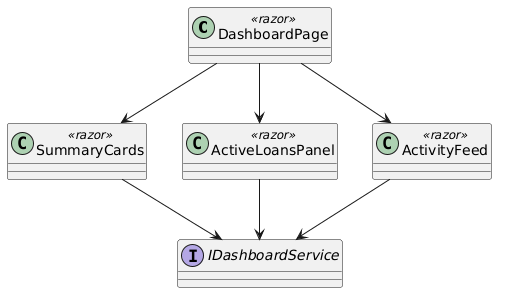
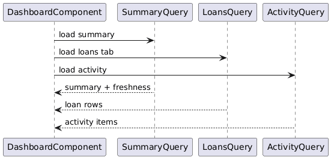

# Module 12: Frontend — Dashboard

**Requirements**: L1-5, L2-5.1, L2-5.2, L2-5.3

**Backend API**: [05-dashboard.md](05-dashboard.md)

## Overview

The frontend dashboard module is the primary landing page after login. It displays summary metric cards, an active loans panel with creditor/borrower tabs, and a recent activity feed. The dashboard loads data in parallel and uses loading skeletons until all sections are ready. The layout adapts across desktop, tablet, and mobile breakpoints as defined in `ui-design.pen`.

## Class Diagram

*Source: [diagrams/plantuml/fe_class_dashboard.puml](diagrams/plantuml/fe_class_dashboard.puml)*

## Screen Designs (from ui-design.pen)

### Dashboard — Desktop (1440px)

**Design reference**: `Dashboard - Desktop`

| Element | Design Details |
|---------|---------------|
| **Layout** | Standard app shell: sidebar (280px, `Dashboard` nav active with `#FFF1F0` bg) + main content (`#F6F7F8` bg, 32px padding, 24px gap between sections) |
| **Header** | Left: "Dashboard" (Bricolage Grotesque 24px 700-weight) + "Welcome back, [name]" (`#6B7280`, DM Sans 14px). Right: notification bell with unread badge + user avatar circle |
| **Metrics Row** | 4 `MetricCard` instances in a horizontal row, each 280px (flex): icon circle (`#FFF1F0` bg, 40px) + label (DM Sans 13px 500-weight `#6B7280`) + value (Bricolage Grotesque 28px 800-weight `#1A1A1A`) |
| **Metric 1** | Icon: `banknote`, Label: "Total Lent Out", Value: "$12,450" |
| **Metric 2** | Icon: `hand-coins`, Label: "Total Owed", Value: "$3,200" |
| **Metric 3** | Icon: `calendar-clock`, Label: "Upcoming (7d)", Value: "5" |
| **Metric 4** | Icon: `alert-circle`, Label: "Overdue", Value: "2" (red variant) |
| **Active Loans Card** | White card (`cornerRadius: 16`, `#F3F4F6` border). Header row: "Active Loans" title + tab pills ("Loans I Gave" / "Loans I Owe"). Table with columns: Person, Amount, Next Due, Status (badge), Action ("View" link) |
| **Recent Activity Card** | White card. Header: "Recent Activity" + "View All" link. Body: chronological list of activity items, each with colored icon circle, description text, and relative timestamp |

### Dashboard — Tablet (768px)

**Design reference**: `Dashboard - Tablet (768px)`

| Element | Design Details |
|---------|---------------|
| **Header** | Top bar: hamburger menu icon + `landmark` icon + "LendQ" text on left, bell + avatar on right |
| **Metrics** | 4 `MetricCard` instances in a 2x2 grid (2 per row with 12px gap) |
| **Active Loans** | Full-width card with same table structure, slightly condensed |
| **No sidebar** | Navigation via collapsible sidebar overlay triggered by hamburger |

### Dashboard — Mobile (375px)

**Design reference**: `Dashboard - Mobile (375px)`

| Element | Design Details |
|---------|---------------|
| **Mobile Header** | 56px height: left (Lucide `landmark` icon + "LendQ"), right (bell icon with badge frame + avatar circle 32px) |
| **Content** | 16px padding, 16px gap between sections |
| **Title** | "Dashboard" (Bricolage Grotesque 24px 700-weight) |
| **Subtitle** | "Welcome back, Quinn" (`#6B7280`, DM Sans 14px) |
| **Metrics** | 2x2 grid (two metric cards per row with 12px gap), each card stacked: icon + label + value |
| **Active Loans** | Vertical section: "Active Loans" header + "View All" link. Card list instead of table: each loan card shows borrower/creditor name, amount, due date, status badge |
| **Bottom Tab Bar** | 64px height, 5 tabs evenly spaced: Home (`layout-dashboard`, `#FF6B6B` active), Loans (`banknote`), Owed (`hand-coins`), Alerts (`bell`), More (`menu`). Active tab icon and label in `#FF6B6B`, inactive in `#9CA3AF` |

## API Integration

| Action | Hook | API Endpoint | Cache Key |
|--------|------|-------------|-----------|
| Summary cards | `useDashboardSummary` | `GET /api/v1/dashboard/summary` | `["dashboard", "summary"]` |
| Active loans | `useDashboardLoans(tab)` | `GET /api/v1/dashboard/loans?tab=creditor\|borrower` | `["dashboard", "loans", tab]` |
| Activity feed | `useDashboardActivity` | `GET /api/v1/dashboard/activity?limit=20` | `["dashboard", "activity"]` |

## Sequence Diagram — Dashboard Load

*Source: [diagrams/plantuml/fe_seq_dashboard_load.puml](diagrams/plantuml/fe_seq_dashboard_load.puml)*

**Behavior**:
1. User navigates to `/dashboard` (default route after login).
2. `DashboardPage` renders loading skeletons for all three sections (summary cards, active loans, activity feed).
3. Three TanStack Query hooks mount in parallel:
   - `useDashboardSummary` checks cache for `["dashboard", "summary"]`, fetches on miss.
   - `useDashboardLoans("creditor")` checks cache for `["dashboard", "loans", "creditor"]`, fetches on miss.
   - `useDashboardActivity` checks cache for `["dashboard", "activity"]`, fetches on miss.
4. As each hook resolves, its section replaces the skeleton with rendered content.
5. Tab switching on the Active Loans panel calls `useDashboardLoans` with the new tab value. If cached, renders immediately; otherwise fetches.

## Component Details

### SummaryCards

Renders 4 `SummaryCard` components. Each card receives:
- `icon`: Lucide icon component
- `label`: metric name
- `value`: number
- `format`: `"currency"` (adds $ and comma formatting) or `"count"` (integer)
- `variant`: `"default"` (standard styling) or `"danger"` (red text for overdue count)

**Responsive grid**:
- Desktop: 4 in a row (`grid-cols-4`)
- Tablet/Mobile: 2x2 grid (`grid-cols-2`)

### ActiveLoansPanel

- Tab pills toggle between "Loans I Gave" (creditor) and "Loans I Owe" (borrower).
- Desktop/tablet: renders a compact data table.
- Mobile: renders a card list where each card shows the counterparty name, amount, next due date, and status badge. Cards are tappable and navigate to the loan detail page.
- Quick action "View" link navigates to `/loans/:id`.

### ActivityFeed

- Shows the last 20 activity items in chronological order.
- Each item has an icon colored by event type:
  - `check-circle` (green): payment recorded
  - `calendar` (blue): payment rescheduled
  - `pause` (amber): payment paused
  - `plus-circle` (purple): new loan created
  - `edit` (gray): loan modified
- Description text summarizes the event.
- Timestamp shown as relative time ("2 hours ago", "Yesterday").
- "View All" link navigates to a full activity history page (or the notifications page filtered to the relevant type).

## Cache Invalidation Strategy

Dashboard data is automatically refreshed when mutations in other modules invalidate overlapping cache keys:
- Recording a payment invalidates `["dashboard"]` — summary recalculates balances.
- Creating a loan invalidates `["dashboard", "loans"]` and `["dashboard", "activity"]`.
- Rescheduling/pausing payments invalidates `["dashboard", "activity"]`.

Stale time is set to 30 seconds for dashboard queries, meaning a return to the dashboard within 30s shows cached data without a refetch.
