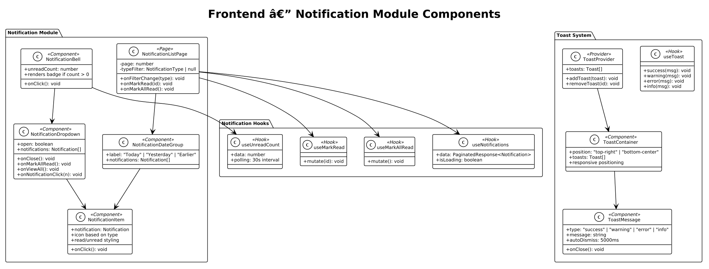
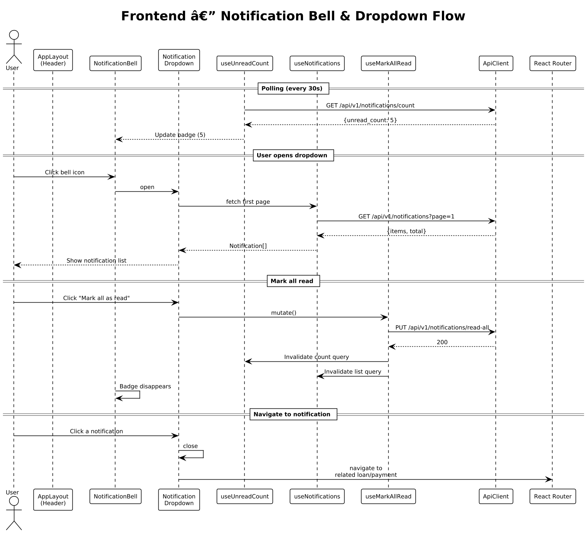

# Module 13: Frontend — Notifications

**Requirements**: L1-6, L2-6.1, L2-6.2, L2-6.3

**Backend API**: [06-notifications.md](06-notifications.md)

## Overview

The frontend notification module provides three notification surfaces: a bell icon with unread count badge in the header, a dropdown panel listing recent notifications, and a full-page notifications screen with filtering. Additionally, a toast system provides real-time feedback for user actions and system events. All components are designed from the `ui-design.pen` specifications.

## Class Diagram



*Source: [diagrams/plantuml/fe_class_notification.puml](diagrams/plantuml/fe_class_notification.puml)*

## Screen Designs (from ui-design.pen)

### Notification Bell & Dropdown

**Design reference**: `Notification Bell Dropdown` (380px width)

| Element | Design Details |
|---------|---------------|
| **Bell Icon** | Lucide `bell` icon in the header bar. When unread count > 0, a small red badge circle with white count text overlays the top-right corner |
| **Dropdown Panel** | White card, `cornerRadius: 16`, shadow (`blur: 32, color: #0000001A, y: 8`), positioned below the bell icon |
| **Dropdown Header** | Left: "Notifications" text (DM Sans 14px 600-weight) + blue badge pill showing unread count. Right: "Mark all read" link in `#FF6B6B` (DM Sans 12px 600-weight) |
| **Divider** | `#F3F4F6` 1px bottom border |
| **Notification Items** | Each item is a row with: unread dot (small `#FF6B6B` ellipse, left), icon circle (colored by type), content column (message text + relative timestamp `#9CA3AF`), bottom border `#F3F4F6` |
| **Unread items** | Background `#FFF8F7` (light pink tint) |
| **Read items** | Background white (no tint), no unread dot |
| **Notification Icons** | `dollar-sign` in green circle for payments, `alert-triangle` in red circle for overdue, `calendar` in blue circle for schedule changes |
| **Dropdown Footer** | Centered: "View all notifications" link in `#FF6B6B` (DM Sans 13px 600-weight), top border `#F3F4F6` |

**Responsive behavior**:
- Desktop/tablet: dropdown positioned below bell icon, right-aligned, 380px width
- Mobile: full-screen panel sliding up from bottom, or navigate directly to `/notifications`

### Toast Notifications

**Design reference**: `Toast Notification Stack` (380px width)

| Variant | Design Details |
|---------|---------------|
| **Success** | White bg, `#DCFCE7` border 1px, `cornerRadius: 12`, shadow. Left: `check-circle` icon in green. Center: message text. Right: `x` close icon (`#9CA3AF`). Width: 360px |
| **Error** | White bg, `#FEE2E2` border 1px. Left: `x-circle` icon in red. Same layout |
| **Warning** | White bg, `#FFFBEB` border 1px. Left: `alert-triangle` icon in amber. Same layout |

**Behavior**:
- Position: top-right on desktop/tablet, bottom-center on mobile
- Auto-dismiss after 5 seconds
- Manual close via `x` button
- Multiple toasts stack vertically with 8px gap
- New toasts appear at the top of the stack

### Full Notifications Page

**Route**: `/notifications`

| Element | Description |
|---------|-------------|
| **Header** | "Notifications" title + "Mark all as read" action link |
| **Filter Tabs** | All, Payments, Overdue, Schedule Changes, System |
| **Date Groups** | Notifications grouped under "Today", "Yesterday", "Earlier" section headers |
| **Notification Items** | Same layout as dropdown items but full-width, with more detail in the message |
| **Pagination** | Standard pagination at the bottom |
| **Empty State** | Bell icon + "No notifications" message when list is empty |

## API Integration

| Action | Hook | API Endpoint | Cache Key |
|--------|------|-------------|-----------|
| Unread count | `useUnreadCount` | `GET /api/v1/notifications/count` | `["notifications", "count"]` |
| List notifications | `useNotifications(page, type)` | `GET /api/v1/notifications?page=&type=` | `["notifications", {page, type}]` |
| Mark single read | `useMarkRead` | `PUT /api/v1/notifications/{id}/read` | Invalidates `["notifications"]` |
| Mark all read | `useMarkAllRead` | `PUT /api/v1/notifications/read-all` | Invalidates `["notifications"]` |

### Polling Strategy

The `useUnreadCount` hook polls `GET /api/v1/notifications/count` every 30 seconds to keep the bell badge updated without a WebSocket connection. The polling interval is configurable. Polling is paused when the browser tab is not visible (using `document.visibilityState`).

## Sequence Diagram — Notification Bell & Dropdown



*Source: [diagrams/plantuml/fe_seq_notifications.puml](diagrams/plantuml/fe_seq_notifications.puml)*

**Behavior**:

### Badge Polling
1. `useUnreadCount` polls `GET /api/v1/notifications/count` every 30 seconds.
2. The response `{unread_count: N}` updates the `NotificationBell` badge. If `N === 0`, the badge is hidden.

### Open Dropdown
1. User clicks the bell icon. `NotificationDropdown` opens.
2. `useNotifications` fetches `GET /api/v1/notifications?page=1` to load recent notifications.
3. Notifications render as items with unread/read styling.

### Mark All Read
1. User clicks "Mark all as read" in the dropdown header.
2. `useMarkAllRead.mutate()` sends `PUT /api/v1/notifications/read-all`.
3. On success: both `["notifications", "count"]` and `["notifications"]` caches are invalidated.
4. The bell badge disappears and all items in the dropdown switch to read styling.

### Click Notification
1. User clicks a notification item.
2. If the notification has an associated `loan_id`, the dropdown closes and React Router navigates to `/loans/{loan_id}`.
3. The notification is marked as read via `useMarkRead.mutate(id)`.

### Navigate to Full Page
1. User clicks "View all notifications" in the dropdown footer.
2. Dropdown closes and navigates to `/notifications`.

## Toast System

### ToastProvider

Wraps the entire app (inside `AuthContext`, outside `Router`). Maintains an array of active toasts and provides `addToast` and `removeToast` functions via React context.

### useToast Hook

```typescript
interface UseToast {
  success(message: string): void;
  warning(message: string): void;
  error(message: string): void;
  info(message: string): void;
}
```

Each method creates a toast with the specified type and message, auto-generates an ID, and adds it to the provider's array. After 5000ms, the toast is automatically removed.

### ToastContainer

Renders the active toast list. Positioned fixed:
- Desktop/tablet: `top: 24px; right: 24px;`
- Mobile: `bottom: 80px; left: 50%; transform: translateX(-50%);` (above the bottom tab bar)

Toasts animate in (slide + fade) and out (fade).

### Integration with Mutations

All TanStack Query mutations across the app use `onSuccess` and `onError` callbacks to trigger toasts:

```typescript
const recordPayment = useRecordPayment({
  onSuccess: () => toast.success("Payment recorded successfully"),
  onError: () => toast.error("Failed to record payment. Please try again."),
});
```

## Notification Type Icons & Colors

| Type | Icon | Color | Example Message |
|------|------|-------|----------------|
| PAYMENT_DUE | `clock` | `#2563EB` (blue) | "Payment of $200 due in 3 days" |
| PAYMENT_OVERDUE | `alert-triangle` | `#DC2626` (red) | "Mike Johnson's payment is overdue by 3 days" |
| PAYMENT_RECEIVED | `check-circle` | `#16A34A` (green) | "Payment of $200 recorded successfully" |
| SCHEDULE_CHANGED | `calendar` | `#CA8A04` (amber) | "Payment rescheduled from Mar 1 to Mar 15" |
| LOAN_MODIFIED | `edit` | `#6B7280` (gray) | "Loan terms updated by creditor" |
| SYSTEM | `info` | `#2563EB` (blue) | "System maintenance scheduled" |
