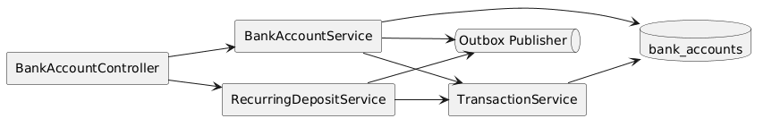
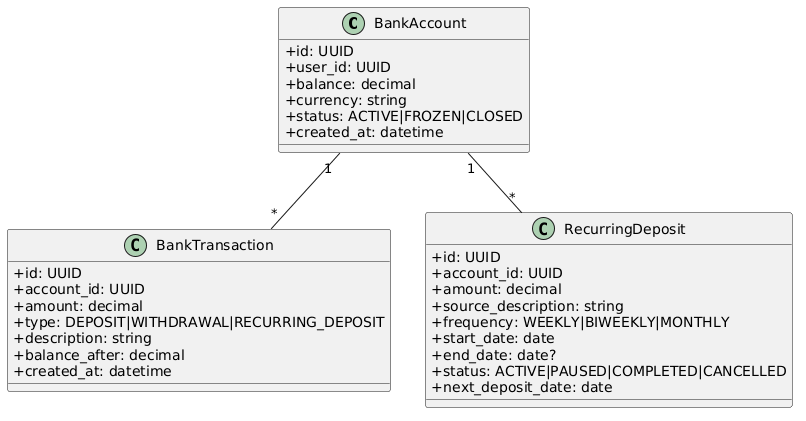
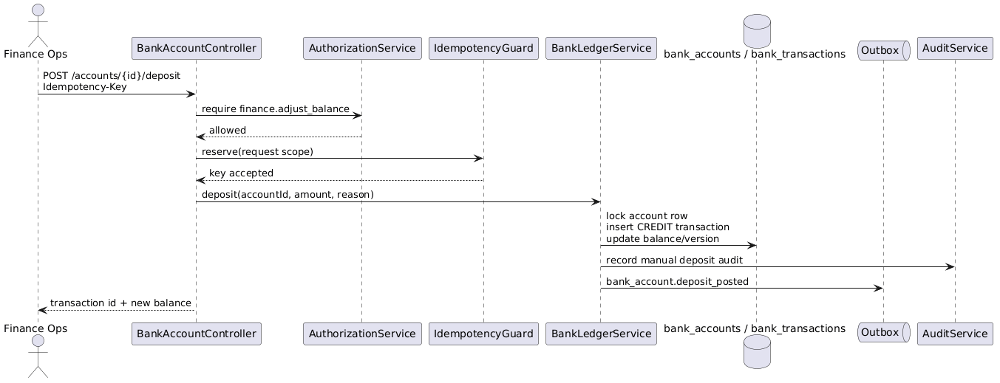
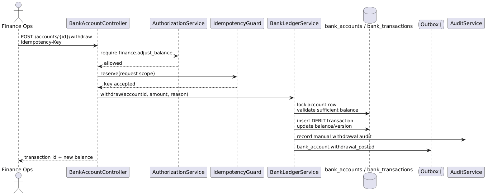
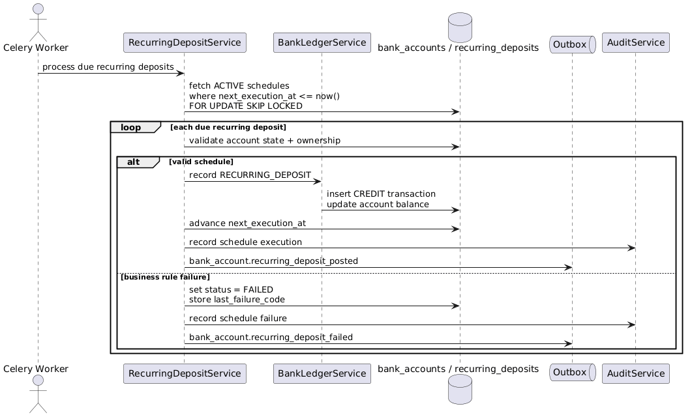

# Module 17: Bank Accounts & Fund Management

**Requirements**: L1-13

## Overview

The bank account module owns the internal stored-value ledger used for user balances, manual finance operations, recurring deposit schedules, and immutable transaction history. This design is intentionally scoped to the LendQ internal ledger. It does not model ACH, card, or open-banking settlement directly.

Manual deposits and withdrawals are exceptional finance operations, not everyday end-user capabilities. They require stronger authorization, explicit business justification, immutable audit, and compensating reversals instead of destructive edits.

## Scope Boundaries

- `bank_accounts` represent LendQ ledger accounts, not external bank-core accounts.
- One account balance exists in exactly one ISO 4217 currency. Cross-currency posting and FX conversion are out of scope.
- Negative balances and overdraft are not supported.
- All monetary writes use the cross-cutting idempotency, outbox, audit, and request-correlation controls from Modules 15 and 16.

## C4 Component Diagram

*Source: [diagrams/plantuml/c4_component_bank_account.puml](diagrams/plantuml/c4_component_bank_account.puml)*

## Class Diagram

*Source: [diagrams/plantuml/class_bank_account.puml](diagrams/plantuml/class_bank_account.puml)*

## Public Endpoints

| Method | Path | Description | Auth |
|---|---|---|---|
| `GET` | `/api/v1/accounts` | List bank accounts (admin: all, user: own) | Bearer |
| `GET` | `/api/v1/accounts/{accountId}` | Get bank account detail including balance | Bearer |
| `POST` | `/api/v1/accounts/{accountId}/deposit` | Post a manual credit into an account | Finance ops |
| `POST` | `/api/v1/accounts/{accountId}/withdraw` | Post a manual debit from an account | Finance ops |
| `POST` | `/api/v1/accounts/transactions/{transactionId}/reversals` | Reverse a prior bank transaction with a compensating entry | Finance ops |
| `GET` | `/api/v1/accounts/{accountId}/transactions` | List transaction history with filters | Bearer |
| `POST` | `/api/v1/accounts/{accountId}/recurring-deposits` | Create a recurring deposit schedule | Bearer |
| `GET` | `/api/v1/accounts/{accountId}/recurring-deposits` | List recurring deposit schedules | Bearer |
| `PATCH` | `/api/v1/accounts/{accountId}/recurring-deposits/{depositId}` | Update a recurring deposit | Bearer |
| `POST` | `/api/v1/accounts/{accountId}/recurring-deposits/{depositId}/pause` | Pause a recurring deposit | Bearer |
| `POST` | `/api/v1/accounts/{accountId}/recurring-deposits/{depositId}/resume` | Resume a paused recurring deposit | Bearer |
| `DELETE` | `/api/v1/accounts/{accountId}/recurring-deposits/{depositId}` | Cancel a recurring deposit | Bearer |

All balance-affecting POST routes require `Idempotency-Key`. History endpoints are cursor-paginated and support date-range, type, and correlation filters.

## Aggregate & Ledger Model

| Entity | Purpose |
|---|---|
| `bank_accounts` | User-owned ledger account with `currency`, `current_balance`, `status`, `timezone`, and optimistic-concurrency `version` |
| `bank_transactions` | Immutable credit and debit entries with `entry_type`, `balance_before`, `balance_after`, `reason_code`, `initiated_by_user_id`, `idempotency_key_hash`, and optional `reversed_transaction_id` |
| `recurring_deposits` | Scheduled deposit definitions with owner, amount, frequency, `execution_time_local`, `timezone`, `next_execution_at`, status, and last-failure tracking |
| `idempotency_records` | Safe-retry registry reused for deposit, withdrawal, reversal, and recurring posting operations |
| `outbox_events` | Durable event handoff for notifications, projections, and downstream reconciliation |

## Authorization & Security Rules

1. End users can read only their own accounts and transactions. Admin listing requires a read-specific administrative permission.
2. Manual deposit, withdrawal, and reversal endpoints require a dedicated finance permission such as `finance.adjust_balance`; generic administrative access is insufficient.
3. Every manual adjustment requires a structured `reason_code`, free-text justification, and optional support-ticket reference. These values are written to immutable audit storage.
4. Policy-defined high-value adjustments require dual control: the initiating actor and approving actor must be different principals.
5. Balance-affecting writes against `FROZEN` or `CLOSED` accounts are rejected, except a finance-approved compensating reversal for a previously posted error.

## Posting Rules

1. Deposit, withdrawal, and reversal requests execute inside a single database transaction, lock the target account row, and increment the account `version`.
2. Each successful posting writes exactly one immutable `bank_transaction` plus one outbox event in the same commit boundary.
3. Debits validate `current_balance >= requested_amount`; requests that would create a negative balance fail with `409 conflict`.
4. Reversals create compensating transactions. Original rows are never edited or deleted.
5. Duplicate retries with the same idempotency key return the original semantic result without creating another transaction.
6. Every response returns the persisted transaction id, updated balance, and request correlation id so operators can reconcile retries.

## Recurring Deposit Rules

1. Recurring deposits are defined with amount, frequency (`WEEKLY`, `BIWEEKLY`, `MONTHLY`), start date, optional end date, local execution time, and timezone.
2. Only the account owner or finance ops can create or edit a recurring deposit, and only on an `ACTIVE` account in the same currency as the scheduled amount.
3. A Celery beat task scans schedules where `next_execution_at <= now()` and `status = ACTIVE`, then workers claim work using `FOR UPDATE SKIP LOCKED`.
4. Each schedule execution is deduplicated by a unique key on `(recurring_deposit_id, scheduled_for_date)` so worker retries cannot double-post money.
5. Each successful execution creates one `bank_transaction` of type `RECURRING_DEPOSIT`, advances `next_execution_at`, and emits a `bank_account.recurring_deposit_posted` event.
6. Resume computes the next future occurrence from the current clock and does not backfill all missed runs automatically. Backfill beyond one occurrence requires an explicit finance operation.
7. Business-rule failures such as frozen account, invalid ownership, or closed account transition the schedule to `FAILED` and emit an operator-visible event. Transient infrastructure failures are retried with backoff.

## Operational & Audit Controls

- Transaction history is append-only and queryable by account, type, initiator, correlation id, and time window.
- Finance adjustments, reversals, recurring-deposit creation, pause, resume, cancel, and failure transitions create immutable audit events with `request_id`, actor, account id, before/after balance, and outcome.
- Outbox events include `bank_account.deposit_posted`, `bank_account.withdrawal_posted`, `bank_account.transaction_reversed`, and `bank_account.recurring_deposit_posted`.
- Monitoring surfaces abnormal reversal rates, failed recurring schedules, and balance-conflict errors.

## Sequences

### Deposit

*Source: [diagrams/plantuml/seq_deposit.puml](diagrams/plantuml/seq_deposit.puml)*

### Withdraw

*Source: [diagrams/plantuml/seq_withdraw.puml](diagrams/plantuml/seq_withdraw.puml)*

### Recurring Deposit Processing

*Source: [diagrams/plantuml/seq_recurring_deposit.puml](diagrams/plantuml/seq_recurring_deposit.puml)*

## Precision Rules

- Currency amounts use fixed-point decimal types.
- Account balance is derived from the immutable ledger, not from mutable cached totals alone.
- Transaction history preserves raw posted amount, currency, and formatted display amount.
- Domain rounding is centralized and reused by APIs, workers, and projections.

## Concurrency

- Deposit, withdrawal, and reversal operations acquire a row-level lock on the account to prevent lost updates.
- Recurring deposit processing is idempotent per schedule per due date and rejects stale schedule edits through optimistic concurrency on `PATCH`.
- Lock acquisition order is consistent across multi-entity operations so downstream modules such as savings transfers can avoid deadlocks.
