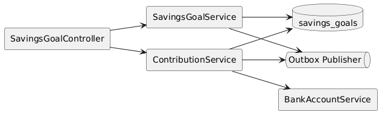
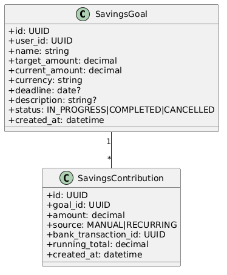
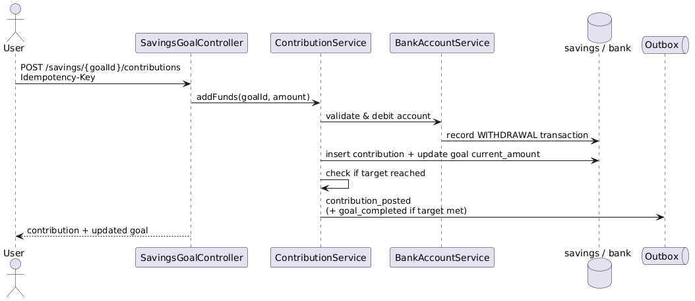

# Module 18: Savings Goals

**Requirements**: L1-14

## Overview

The savings goals module provides an internal reserved-balance ledger that lets users earmark funds from their LendQ bank account toward named goals. Contributions and releases are paired ledger moves between the funding account and the goal reserve. This avoids trapped balances and keeps the savings feature consistent with the immutable money-movement model used elsewhere in the system.

Savings goals are not interest-bearing products and do not represent external custody accounts. They are internal allocation constructs backed by the Module 17 bank-account ledger.

## C4 Component Diagram

*Source: [diagrams/plantuml/c4_component_savings.puml](diagrams/plantuml/c4_component_savings.puml)*

## Class Diagram

*Source: [diagrams/plantuml/class_savings.puml](diagrams/plantuml/class_savings.puml)*

## Public Endpoints

| Method | Path | Description | Auth |
|---|---|---|---|
| `GET` | `/api/v1/savings` | List savings goals for the current user | Bearer |
| `POST` | `/api/v1/savings` | Create a new savings goal | Bearer |
| `GET` | `/api/v1/savings/{goalId}` | Get savings goal detail including progress | Bearer |
| `PATCH` | `/api/v1/savings/{goalId}` | Update goal name, target, deadline, or description | Bearer |
| `POST` | `/api/v1/savings/{goalId}/cancel` | Soft-cancel an empty savings goal | Bearer |
| `POST` | `/api/v1/savings/{goalId}/contributions` | Add funds from bank account toward goal | Bearer |
| `POST` | `/api/v1/savings/{goalId}/release` | Move reserved funds back to an eligible bank account | Bearer |
| `GET` | `/api/v1/savings/{goalId}/entries` | List immutable savings-goal ledger history | Bearer |

Balance-affecting contribution and release routes require `Idempotency-Key`.

## Aggregate & Ledger Model

| Entity | Purpose |
|---|---|
| `savings_goals` | Goal identity, owner, target amount, current reserved amount, currency, deadline, status, and optimistic-concurrency `version` |
| `savings_goal_entries` | Immutable reserve-ledger entries with `direction`, `entry_type`, linked `bank_transaction_id`, amount, running total, and idempotency metadata |
| `bank_transactions` | Paired bank-account ledger rows from Module 17 for contributions and releases |

## Ownership & Security Rules

1. Users can fund or release only goals they own and only from or to their own eligible `ACTIVE` bank accounts.
2. Goal currency is fixed at creation and must match the source or destination bank account currency.
3. Direct administrative mutation of a goal balance is not permitted. Any correction must be posted through a finance-controlled compensating bank transaction and a matching goal entry.
4. Goal creation, funding, release, cancellation, and target-met transitions create immutable audit events and user-visible notification events.

## Goal Rules

1. Each goal has a positive `target_amount`, optional `deadline`, fixed `currency`, and `current_amount` derived from immutable goal entries.
2. Status transitions are value-based:
   `IN_PROGRESS -> COMPLETED` when `current_amount >= target_amount`
   `COMPLETED -> IN_PROGRESS` if a later release drops the reserved amount below target
   `IN_PROGRESS -> CANCELLED` only when `current_amount = 0`
3. Cancelled goals are immutable and excluded from default active-list queries.
4. Updating a target below `current_amount` is rejected with `409 conflict`.
5. Goals without a deadline do not expire automatically.

## Contribution Rules

1. Adding funds validates that the requested amount is positive, the source account belongs to the caller, the account is `ACTIVE`, and the requested amount does not exceed the available balance.
2. A contribution debits the bank account and credits the goal reserve in a single database transaction, creating one `bank_transaction` and one `savings_goal_entry`.
3. Each contribution records a `running_total` for display and reconciliation.
4. When a contribution causes `current_amount >= target_amount`, the goal status transitions to `COMPLETED` and a `savings.goal_target_met` event is emitted.
5. Duplicate retries with the same idempotency key return the original semantic result.

## Release Rules

1. Release requests move money from the goal reserve back to an eligible bank account owned by the same user and in the same currency.
2. A release amount must be positive and `<= current_amount`.
3. Release executes as a paired ledger write in one transaction: debit goal reserve, credit bank account, persist outbox event.
4. Partial release is allowed. A full release to zero allows the user to cancel the goal explicitly.
5. Completed goals can be released from; if the remaining reserved balance drops below target, status returns to `IN_PROGRESS`.

## Operational Controls

- Goal history is append-only and exposed through `GET /entries`, not reconstructed from mutable snapshots.
- Outbox events include `savings.goal_contributed`, `savings.goal_released`, `savings.goal_target_met`, and `savings.goal_cancelled`.
- Notification fan-out uses the same outbox and worker pipeline defined in Module 6.

## Sequences

### Add Funds to Goal

*Source: [diagrams/plantuml/seq_add_funds_to_goal.puml](diagrams/plantuml/seq_add_funds_to_goal.puml)*

## Precision Rules

- Currency amounts use fixed-point decimal types consistent with the bank account module.
- Goal and funding account currency must match exactly; implicit conversion is not permitted.
- Progress percentage is calculated as `(current_amount / target_amount) * 100`, rounded to one decimal place for display.

## Concurrency

- Contribution and release operations acquire row-level locks on both the bank account and the savings goal in a deterministic order to prevent race conditions and deadlocks.
- Goal completion and reversion-to-in-progress detection are performed in the same transaction as the money movement.
- Goal edits require an `expected_version` field or equivalent `If-Match` header to reject stale writes.
