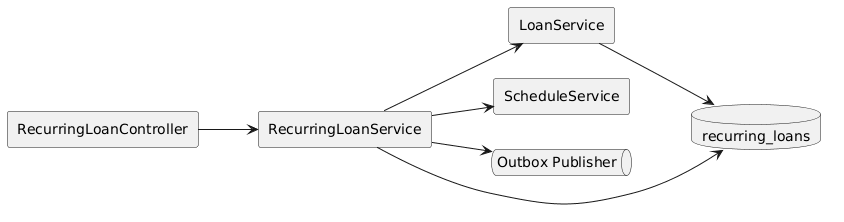
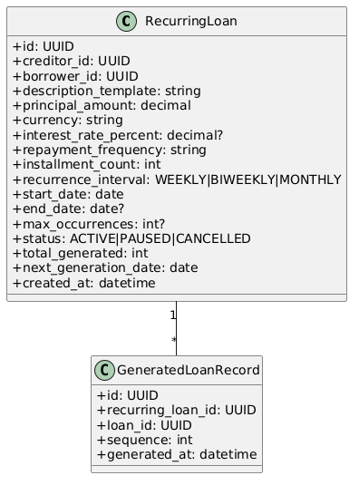
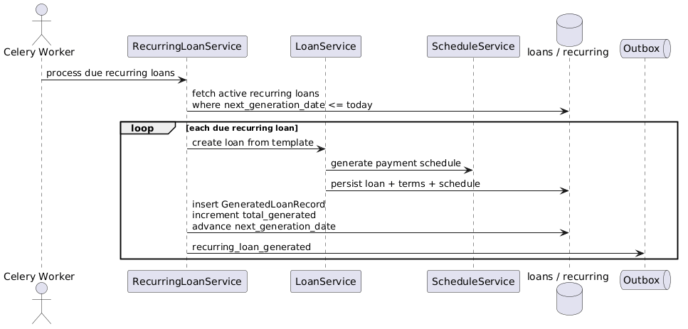
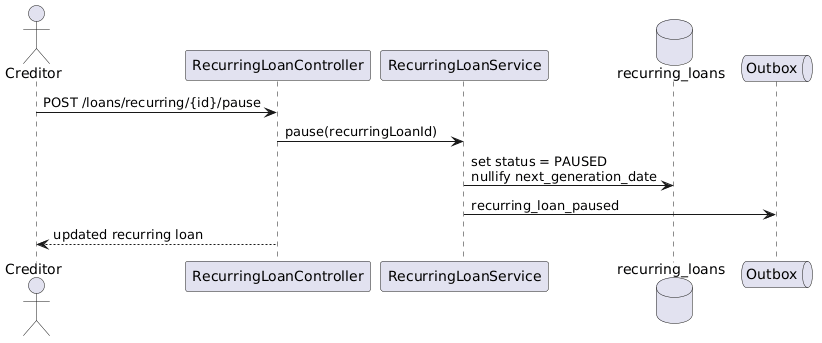

# Module 19: Recurring Loans

**Requirements**: L1-15

## Overview

The recurring loans module allows a creditor to define a reusable loan template that can generate future loans on a schedule, but only after the borrower has approved the active template version. Each generation produces a standard loan using the governed loan-creation flow from Module 3, including terms versioning and schedule generation.

Because this feature can create future debt automatically, the design treats borrower consent, template versioning, and generation policy checks as first-class controls. A creditor cannot unilaterally activate or materially change an automatically generating template without renewed borrower approval.

## C4 Component Diagram

*Source: [diagrams/plantuml/c4_component_recurring_loan.puml](diagrams/plantuml/c4_component_recurring_loan.puml)*

## Class Diagram

*Source: [diagrams/plantuml/class_recurring_loan.puml](diagrams/plantuml/class_recurring_loan.puml)*

## Public Endpoints

| Method | Path | Description | Auth |
|---|---|---|---|
| `GET` | `/api/v1/loans/recurring` | List recurring loan templates visible to the current actor | Creditor, Borrower participant |
| `POST` | `/api/v1/loans/recurring` | Create a new draft recurring loan template | Creditor |
| `GET` | `/api/v1/loans/recurring/{recurringId}` | Get recurring loan detail including approval state and generated history | Creditor owner, Borrower participant |
| `PATCH` | `/api/v1/loans/recurring/{recurringId}` | Update a draft, paused, or suspended template | Creditor owner |
| `POST` | `/api/v1/loans/recurring/{recurringId}/submit-for-approval` | Send the current template version to the borrower for approval | Creditor owner |
| `POST` | `/api/v1/loans/recurring/{recurringId}/approve` | Approve and activate the pending recurring loan template | Borrower participant |
| `POST` | `/api/v1/loans/recurring/{recurringId}/reject` | Reject the pending recurring loan template | Borrower participant |
| `POST` | `/api/v1/loans/recurring/{recurringId}/pause` | Pause recurring loan generation | Creditor owner |
| `POST` | `/api/v1/loans/recurring/{recurringId}/resume` | Resume a paused recurring loan | Creditor owner |
| `POST` | `/api/v1/loans/recurring/{recurringId}/cancel` | Permanently cancel recurring loan generation and revoke future consent | Creditor owner, Borrower participant |
| `GET` | `/api/v1/loans/recurring/{recurringId}/generated` | List all loans generated by this recurring loan | Creditor owner, Borrower participant |

## Aggregate Model

| Entity | Purpose |
|---|---|
| `recurring_loans` | Stable template identity with creditor, borrower, lifecycle status, recurrence policy, next generation time, failure state, and active approved version pointer |
| `recurring_loan_template_versions` | Immutable template snapshots for principal, currency, interest, repayment structure, description template, and generated-loan policy flags |
| `recurring_loan_consents` | Borrower approval or rejection records tied to a specific template version and decision timestamp |
| `generated_loan_records` | Mapping from recurring loan to each generated loan instance with scheduled generation date, sequence number, and template version used |

Generated loans are standard `loans` rows managed by the existing loan module (Module 3). The `generated_loan_records` table links them back to their recurring loan source.

## Template Rules

Each template version includes:

- `borrower_id`
- `description_template`
- `principal_amount` and `currency`
- `interest_rate_percent` (optional)
- `repayment_frequency` (weekly, bi-weekly, monthly)
- `installment_count`
- `recurrence_interval` (how often a new loan is created)
- `start_date`
- `end_date` or `max_occurrences` (optional, at least one required if not indefinite)
- `timezone`
- `allow_parallel_active_generated_loans` (default `false`)
- `max_generated_loan_principal_exposure` (policy-validated cap)

Template versions are immutable once submitted for borrower approval. Any material change to principal, currency, repayment structure, borrower, recurrence interval, or exposure policy creates a new pending version and blocks future generation until the borrower approves it.

## Consent & Authorization Rules

1. A recurring loan cannot enter `ACTIVE` until the borrower approves the currently pending template version.
2. Borrower approval binds to the exact template-version hash. Approval of an older version does not authorize generation from a later edited version.
3. Creditor and borrower must both be active, non-blocked users at approval time and at each generation time.
4. Borrowers can cancel a recurring loan at any time, which revokes consent for all future generations. Existing generated loans are unaffected.
5. All create, update, submit, approve, reject, pause, resume, cancel, and generation actions create immutable audit records and notification events for both parties.

## Generation Rules

1. A Celery beat task scans recurring loans where `next_generation_at <= now()` and `status = ACTIVE`.
2. Workers claim due rows using `FOR UPDATE SKIP LOCKED` and enforce a uniqueness key on `(recurring_loan_id, scheduled_for_date)`.
3. Before creation, the worker re-validates that the creditor and borrower are active, the approved template version is current, consent has not been revoked, policy caps are not exceeded, and parallel-loan policy allows another generated loan.
4. For each due recurring loan, the worker creates a new loan through `LoanService` using the approved template version, so standard loan validation, terms versioning, and schedule generation still apply.
5. A `generated_loan_record` is inserted with the scheduled generation date, sequence number, and template version id used for that loan.
6. `total_generated` is incremented and `next_generation_at` is advanced by the recurrence interval.
7. If `max_occurrences` is reached or the next generation would exceed `end_date`, the recurring loan transitions to `COMPLETED`.
8. Generation is idempotent per recurring loan per scheduled date, so retries return the same semantic result without creating a duplicate loan.
9. Transient infrastructure failures are retried. Business-rule failures, such as revoked consent or policy-cap breach, transition the recurring loan to `SUSPENDED` and require operator-visible remediation.

## Lifecycle Rules

1. **Draft** — creditor-editable, not yet submitted to the borrower.
2. **Pending Approval** — waiting for borrower approval or rejection of the current template version.
3. **Active** — borrower-approved and generating new loans on schedule.
4. **Paused** — manually suspended by the creditor; no new loans are generated.
5. **Suspended** — automatically stopped after a policy or validation failure. Existing generated loans are unaffected.
6. **Completed** — terminal state reached because the recurrence end condition was satisfied.
7. **Cancelled** — terminal state initiated by the creditor or borrower. Future consent is revoked.

Resume computes the next future occurrence from the current time and does not automatically backfill every missed generation.

## Sequences

### Generate Recurring Loan

*Source: [diagrams/plantuml/seq_generate_recurring_loan.puml](diagrams/plantuml/seq_generate_recurring_loan.puml)*

### Pause Recurring Loan

*Source: [diagrams/plantuml/seq_pause_recurring_loan.puml](diagrams/plantuml/seq_pause_recurring_loan.puml)*

## Concurrency

- Recurring loan generation acquires a row-level lock on the recurring-loan row to prevent duplicate work by concurrent workers.
- Pause, resume, cancel, approve, and reject operations are idempotent and reject duplicate terminal transitions.
- Edit operations require `expected_version` and return `409 conflict` on stale writes.
- Approval and generation both reference immutable template-version ids so a race between edit and approval cannot activate the wrong terms.
